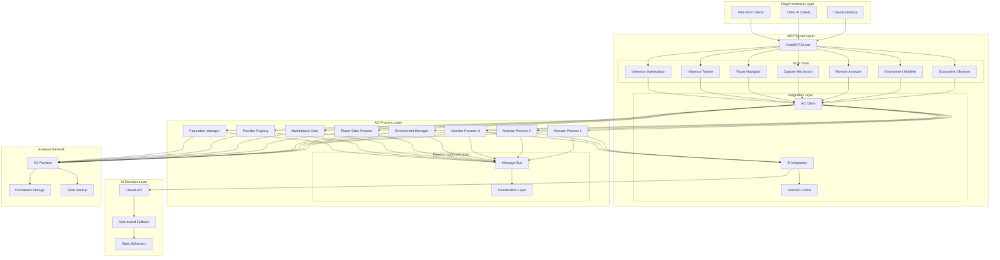
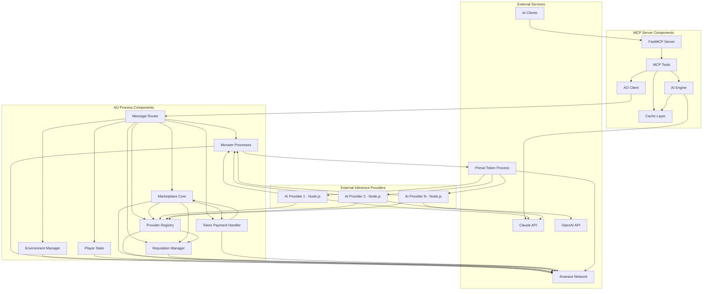
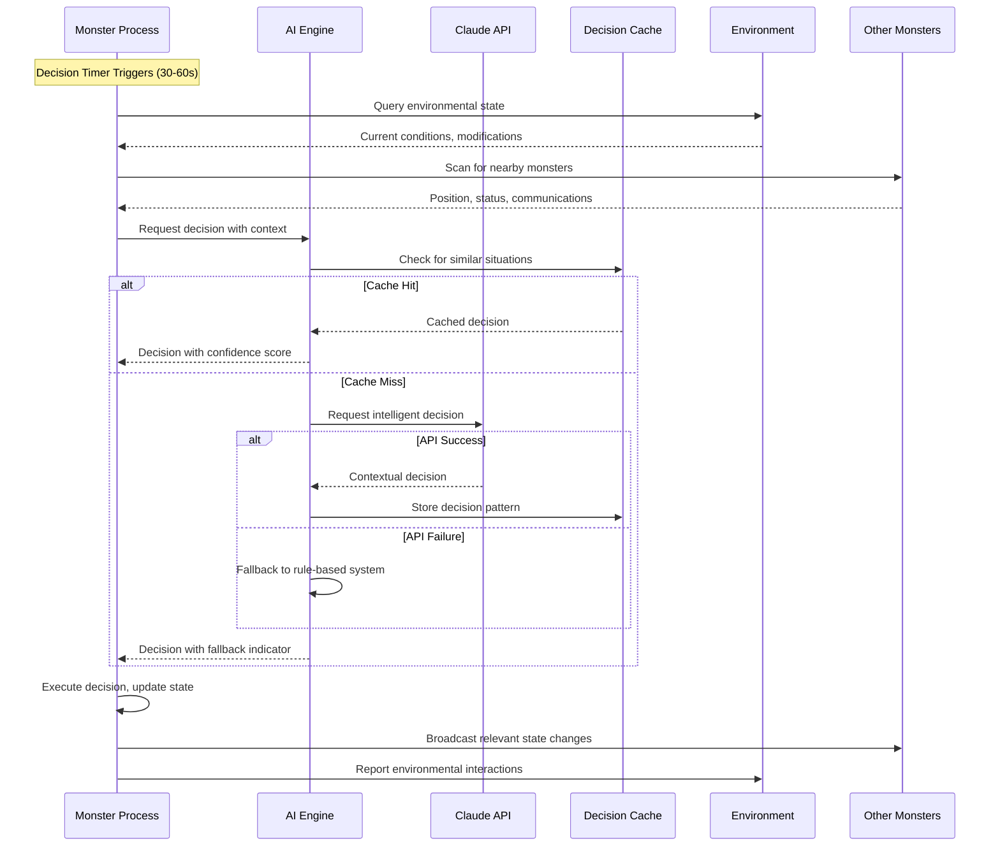
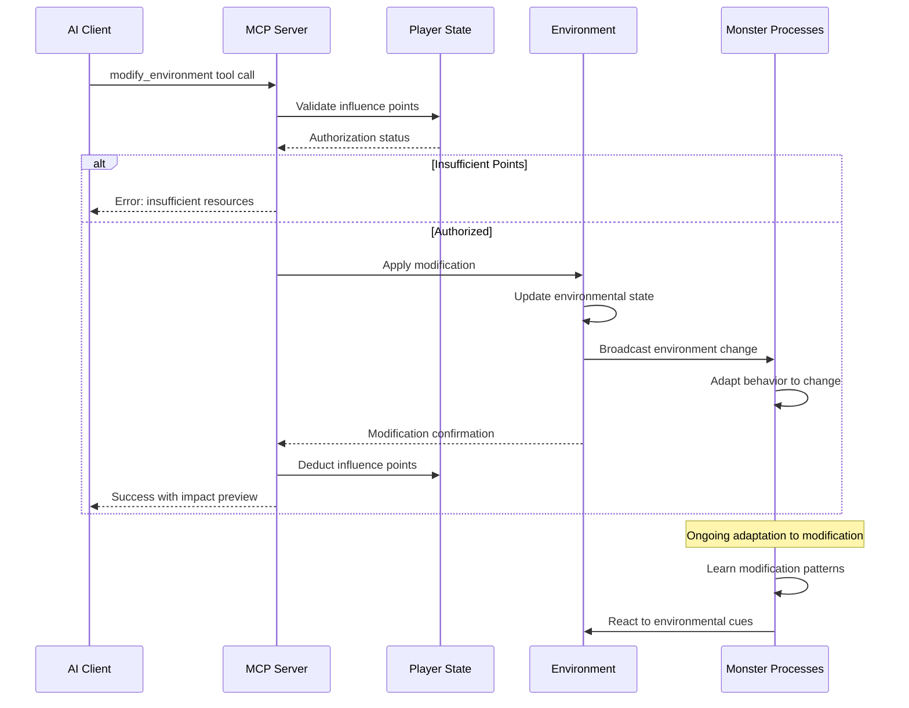
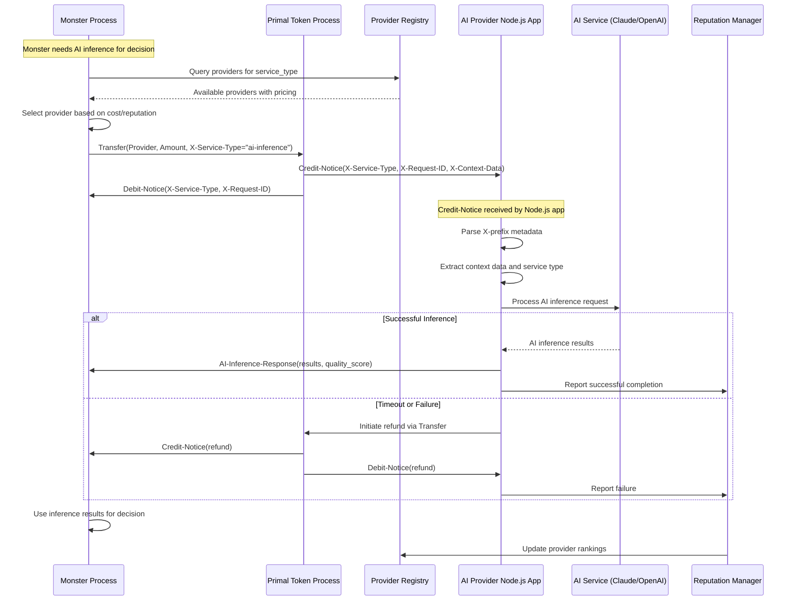
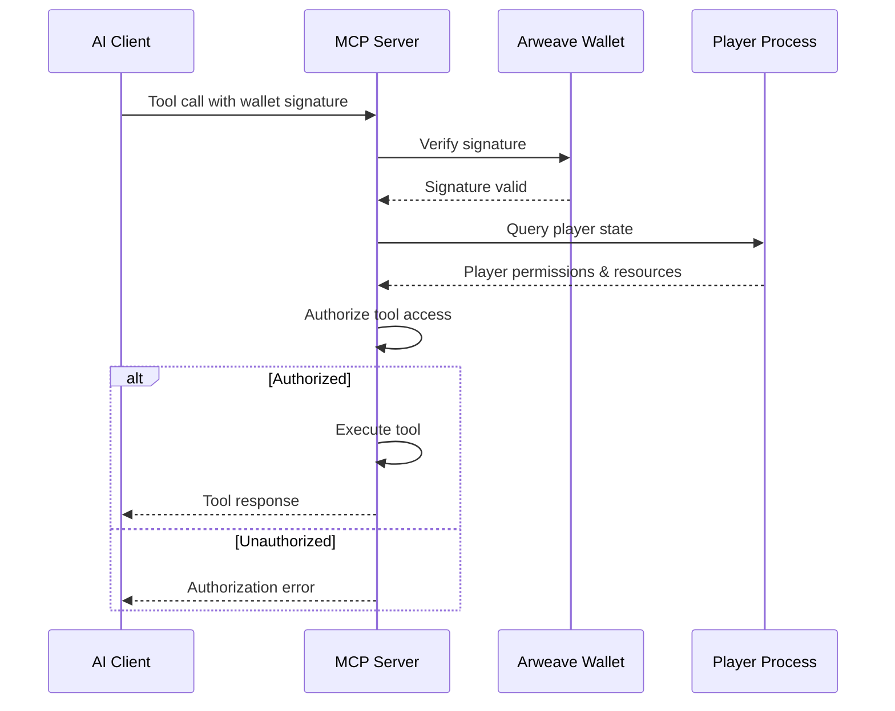
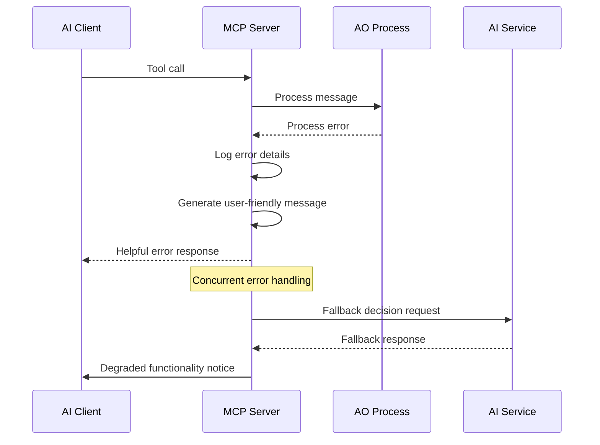

# PrimalCode Fullstack Architecture Document

## Introduction

This document outlines the complete fullstack architecture for PrimalCode, including backend systems, frontend implementation, and their integration. It serves as the single source of truth for AI-driven development, ensuring consistency across the entire technology stack.

This unified approach combines what would traditionally be separate backend and frontend architecture documents, streamlining the development process for modern fullstack applications where these concerns are increasingly intertwined.

### Starter Template or Existing Project

**Base Framework:** FastMCP boilerplate (https://github.com/punkpeye/fastmcp)

The project leverages FastMCP as the foundation for MCP server development, providing:
- Pre-configured TypeScript setup optimized for MCP tool development
- Standardized project structure for conversational AI interfaces
- Built-in MCP protocol handling and Claude Desktop integration
- Proven patterns for natural language tool development

This choice constrains the architecture to TypeScript-based MCP server patterns while enabling rapid development of conversational ecosystem management tools.

### Change Log

| Date | Version | Description | Author |
|------|---------|-------------|--------|
| 2025-07-15 | 1.0 | Initial architecture document creation | Winston (Architect) |
| 2025-07-15 | 1.1 | Added Inference Marketplace (Epic 2) architecture | Winston (Architect) |
| 2025-07-15 | 1.2 | Added Node.js Inference Provider architecture and Credit-Notice flow | Winston (Architect) |

## High Level Architecture

### Technical Summary

PrimalCode implements a **conversational MCP server architecture** where players interact with autonomous AI creatures through natural language commands via Claude Desktop. The system leverages **AO processes** for persistent, autonomous monster behavior, with each creature running as an independent process on the Arweave network. The **FastMCP boilerplate** provides the bridge between AI clients and the creature ecosystem, enabling rich text-based ecosystem management without traditional UI complexity. 

**Epic 2 Enhancement:** The architecture now includes an **AI Inference Marketplace** that enables autonomous processes to request AI inference services by transferring Primal tokens to providers, with automated registry and reputation management. This creates a token-based economy for AI services while maintaining the core autonomous creature experience.

This architecture creates a truly unique gaming experience that combines decentralized autonomous agents with natural language interaction patterns and a distributed AI services economy.

### Platform and Infrastructure Choice

**Platform:** Hybrid Cloud + Arweave/AO Network

**Key Services:**
- **MCP Server Hosting:** AWS/Vercel with auto-scaling capabilities
- **Autonomous Processes:** AO Runtime on Arweave network
- **AI Integration:** Claude API with intelligent fallback systems
- **Monitoring:** CloudWatch + Custom AO process health monitoring
- **Storage:** AO process state + Arweave permanent backup

**Deployment Host and Regions:** 
- Primary: US-East (Virginia) for low latency to Claude API
- Secondary: EU-West (Ireland) for global accessibility
- AO Network: Global decentralized deployment

### Repository Structure

**Structure:** Monorepo with specialized MCP + AO architecture

**Monorepo Tool:** npm workspaces (lightweight, FastMCP compatible)

**Package Organization:**
- `src/` - MCP server implementation
- `ao-processes/` - Lua-based monster and environment processes
- `packages/shared/` - TypeScript types shared between MCP tools
- `docs/` - Architecture and API documentation
- `scripts/` - Deployment and AO process management utilities

### High Level Architecture Diagram



### Architectural Patterns

- **Conversational Interface Pattern:** Natural language tool interfaces for complex ecosystem management - _Rationale:_ Enables intuitive interaction with complex autonomous systems without traditional UI complexity
- **Autonomous Agent Pattern:** Independent AO processes with persistent state and decision-making - _Rationale:_ Creates truly autonomous creatures that operate independently of player presence
- **Multi-tier Decision Fallback:** Hierarchical AI decision system with graceful degradation - _Rationale:_ Ensures system reliability while maintaining intelligent behavior under various conditions
- **Event-Driven Communication:** AO message passing for inter-process coordination - _Rationale:_ Enables complex creature interactions while maintaining process isolation
- **Decentralized Persistence:** State management through AO processes with Arweave backup - _Rationale:_ Provides permanent, tamper-proof game state without traditional database costs
- **Tool-Based Architecture:** MCP tools as primary interface abstraction - _Rationale:_ Standardizes natural language interactions while maintaining extensibility
- **Token-Based Marketplace Pattern:** AO Token Blueprint with Credit-Notice/Debit-Notice handlers - _Rationale:_ Creates organic economic activity through AI inference service trading
- **X-Prefix Forwarding Pattern:** Extensible metadata passing through token transfers - _Rationale:_ Enables contextual information flow in marketplace transactions

## Tech Stack

### Technology Stack Table

| Category | Technology | Version | Purpose | Rationale |
|----------|------------|---------|---------|-----------|
| MCP Server Language | TypeScript | 5.0+ | MCP tool development | Type safety, excellent tooling, FastMCP compatibility |
| MCP Framework | FastMCP | Latest | MCP server boilerplate | Rapid development, proven patterns, active community |
| Monster AI Language | Lua | 5.4+ | AO process implementation | Native AO language, lightweight, proven for blockchain |
| AI Decision Engine | Claude API | 3.5+ | Monster intelligence | Superior reasoning, context awareness, cost-effective |
| Persistence Layer | AO Processes | Latest | Autonomous creature state | Decentralized persistence, no gas fees, true autonomy |
| Permanent Storage | Arweave | Latest | Long-term data backup | Immutable history, decentralized, cost-effective |
| Client Interface | Claude Desktop | Latest | Player interaction | Native MCP support, natural language interface |
| Testing Framework | Jest | 29+ | Unit/integration testing | Industry standard, TypeScript support, comprehensive |
| Build Tool | TypeScript Compiler | 5.0+ | Compilation | Native TypeScript support, fast compilation |
| Package Manager | npm | 9+ | Dependency management | FastMCP compatibility, standard tooling |
| Monitoring | Winston | 3.8+ | Logging and debugging | Structured logging, multiple transports |
| Error Tracking | Custom | 1.0 | Error aggregation | Specialized for AO process errors |
| Message Schema | JSON Schema | 7.0+ | AO message validation | Standardized validation, TypeScript integration |
| API Client | Axios | 1.6+ | HTTP communication | Reliable HTTP client, interceptor support |
| Environment Config | dotenv | 16+ | Configuration management | Standard environment variable handling |
| Process Management | PM2 | 5.3+ | Production process management | Process monitoring, auto-restart capabilities |
| Documentation | TypeDoc | 0.25+ | API documentation | TypeScript-native documentation generation |
| Linting | ESLint | 8.0+ | Code quality | Standard linting, TypeScript support |
| Formatting | Prettier | 3.0+ | Code formatting | Consistent formatting, team collaboration |

## Data Models

### Monster

**Purpose:** Represents an autonomous creature with persistent state, AI personality, and environmental awareness

**Key Attributes:**
- id: string - Unique identifier for the monster process
- species: string - Monster type determining base behavior patterns
- stats: MonsterStats - Health, hunger, energy, position tracking
- ai_personality: PersonalityTraits - Aggression, intelligence, pack tendency
- environmental_awareness: EnvironmentalData - Detected structures, resource memory
- influence_resistance: AdaptationData - Learned patterns, counter-strategies

#### TypeScript Interface

```typescript
interface Monster {
  id: string;
  species: MonsterSpecies;
  stats: {
    health: number;
    hunger: number;
    energy: number;
    position: {
      x: number;
      y: number;
      route: string;
    };
  };
  ai_personality: {
    aggression: number;
    intelligence: number;
    pack_tendency: number;
  };
  environmental_awareness: {
    detected_structures: string[];
    resource_memory: ResourceMemory[];
    weather_adaptation: number;
  };
  influence_resistance: {
    learned_patterns: Record<string, number>;
    adaptation_history: AdaptationEvent[];
  };
  state: MonsterState;
  last_decision: Date;
}
```

#### Relationships
- Belongs to Route (1:N)
- Communicates with other Monsters (N:N)
- Affected by Environmental Modifications (N:N)
- Owned by Player through Capture (N:1)

### Environment

**Purpose:** Manages route-level environmental state including structures, resources, and weather conditions

**Key Attributes:**
- route_id: string - Unique identifier for the habitat area
- structures: EnvironmentalStructure[] - Active player modifications
- resources: ResourcePool[] - Food, water, scent markers
- weather_state: WeatherCondition - Current environmental conditions
- ecosystem_balance: number - Natural vs artificial balance metric

#### TypeScript Interface

```typescript
interface Environment {
  route_id: string;
  structures: EnvironmentalStructure[];
  resources: ResourcePool[];
  weather_state: WeatherCondition;
  influence_points: InfluencePoint[];
  ecosystem_balance: number;
  last_modified: Date;
}
```

#### Relationships
- Contains multiple Monsters (1:N)
- Modified by Player Actions (N:N)
- Influences Monster Behavior (1:N)

### Player

**Purpose:** Tracks player progression, influence points, and ecosystem management history

**Key Attributes:**
- wallet_address: string - Arweave wallet for authentication
- influence_points: number - Available resources for modifications
- unlocked_tools: string[] - Available environmental modification tools
- ecosystem_mastery: MasteryLevel[] - Expertise in different routes
- capture_collection: string[] - Owned monster IDs

#### TypeScript Interface

```typescript
interface Player {
  wallet_address: string;
  influence_points: number;
  unlocked_tools: EnvironmentalTool[];
  ecosystem_mastery: {
    route_id: string;
    mastery_level: number;
    specialization: string;
  }[];
  capture_collection: string[];
  session_history: SessionData[];
}
```

#### Relationships
- Owns multiple Captured Monsters (1:N)
- Modifies multiple Environments (N:N)
- Earns Influence Points through successful management
- Participates in Inference Marketplace (1:N)

### Inference Marketplace Provider

**Purpose:** Represents an AI inference service provider in the marketplace with capabilities, pricing, and reputation

**Key Attributes:**
- provider_id: string - Unique identifier for the AI service provider
- capabilities: string[] - Types of AI services offered
- pricing: PricingModel - Token costs per service type
- reputation: ReputationMetrics - Quality and performance indicators
- metadata: ProviderMetadata - Additional provider information

#### TypeScript Interface

```typescript
interface InferenceProvider {
  provider_id: string;
  capabilities: string[];
  pricing: {
    [service_type: string]: string; // tokens per request
  };
  reputation: {
    response_time_avg: number;
    quality_score: number;
    completion_rate: number;
    total_requests: number;
  };
  metadata: {
    last_seen: number;
    x_tags_supported: string[];
    description: string;
  };
  status: "active" | "inactive" | "suspended";
}
```

#### Relationships
- Handles multiple Inference Requests (1:N)
- Has Reputation History (1:N)
- Managed by Marketplace Core (N:1)

### Inference Request

**Purpose:** Represents a request for AI inference services with payment and context information

**Key Attributes:**
- request_id: string - Unique identifier for the inference request
- requester: string - AO process ID making the request
- provider_id: string - Target AI service provider
- service_type: string - Type of AI service requested
- context_data: any - Inference parameters and context
- payment_amount: string - Token amount for the service
- x_metadata: XMetadata - X-prefix forwarded tags

#### TypeScript Interface

```typescript
interface InferenceRequest {
  request_id: string;
  requester: string;
  provider_id: string;
  service_type: string;
  context_data: any;
  payment_amount: string;
  x_metadata: {
    [key: string]: string; // X-prefixed tags
  };
  status: "pending" | "processing" | "completed" | "failed";
  created_at: number;
  timeout_at: number;
}
```

#### Relationships
- Issued by Monster Process (N:1)
- Processed by Inference Provider (N:1)
- Tracked by Marketplace Core (N:1)

### Marketplace Transaction

**Purpose:** Records token transfers and AI service transactions for audit and reputation tracking

**Key Attributes:**
- transaction_id: string - Unique identifier for the transaction
- request_id: string - Associated inference request
- from_process: string - Token sender (requester)
- to_process: string - Token recipient (provider)
- amount: string - Token amount transferred
- service_type: string - Type of AI service
- success: boolean - Transaction completion status

#### TypeScript Interface

```typescript
interface MarketplaceTransaction {
  transaction_id: string;
  request_id: string;
  from_process: string;
  to_process: string;
  amount: string;
  service_type: string;
  success: boolean;
  timestamp: number;
  credit_notice_sent: boolean;
  debit_notice_sent: boolean;
}
```

#### Relationships
- Associated with Inference Request (1:1)
- Tracked by Reputation Manager (N:1)
- Logged by Marketplace Core (N:1)

## API Specification

### MCP Tool Specification

The API follows MCP (Model Context Protocol) tool patterns for natural language interaction:

```typescript
// MCP Tool Schema
interface MCPTool {
  name: string;
  description: string;
  inputSchema: {
    type: "object";
    properties: Record<string, any>;
    required: string[];
  };
}

// Ecosystem Observer Tool
const observeEcosystemTool: MCPTool = {
  name: "observe_ecosystem",
  description: "Get detailed natural language description of current ecosystem state",
  inputSchema: {
    type: "object",
    properties: {
      route_id: { type: "string", description: "Route/habitat to observe" },
      focus: { type: "string", description: "Specific aspect to focus on (monsters, environment, interactions)" }
    },
    required: ["route_id"]
  }
};

// Environment Modifier Tool
const modifyEnvironmentTool: MCPTool = {
  name: "modify_environment",
  description: "Make strategic environmental changes to influence monster behavior",
  inputSchema: {
    type: "object",
    properties: {
      route_id: { type: "string", description: "Route to modify" },
      modification_type: { type: "string", enum: ["shelter", "food", "barrier", "weather"] },
      location: { type: "object", properties: { x: { type: "number" }, y: { type: "number" } } },
      parameters: { type: "object", description: "Modification-specific parameters" }
    },
    required: ["route_id", "modification_type", "location"]
  }
};

// Inference Marketplace Tool
const inferenceMarketplaceTool: MCPTool = {
  name: "inference_marketplace",
  description: "Interact with AI inference marketplace - discover providers, request services, check reputation",
  inputSchema: {
    type: "object",
    properties: {
      action: { type: "string", enum: ["discover_providers", "request_inference", "check_reputation", "view_transactions"] },
      service_type: { type: "string", description: "Type of AI service needed" },
      provider_id: { type: "string", description: "Specific provider ID (optional)" },
      context_data: { type: "object", description: "Inference parameters and context" },
      max_cost: { type: "string", description: "Maximum tokens willing to spend" }
    },
    required: ["action"]
  }
};
```

### AO Message Schemas

Inter-process communication follows standardized message formats:

```typescript
// Monster Decision Request
interface MonsterDecisionMessage {
  Action: "Make-Decision";
  Data: {
    monster_id: string;
    context: {
      current_state: MonsterState;
      environment: EnvironmentalContext;
      nearby_monsters: MonsterInfo[];
      player_influences: PlayerInfluence[];
    };
    decision_urgency: "low" | "medium" | "high";
  };
}

// Environment Modification Message
interface EnvironmentModificationMessage {
  Action: "Environment-Change";
  Data: {
    route_id: string;
    modification: {
      type: string;
      location: { x: number; y: number };
      parameters: Record<string, any>;
      duration: number;
    };
    player_id: string;
  };
}

// Monster Communication Message
interface MonsterCommunicationMessage {
  Action: "Monster-Communication";
  Data: {
    message_type: "territory_claim" | "threat_warning" | "resource_share";
    sender_id: string;
    target_id?: string;
    content: Record<string, any>;
    urgency: "low" | "medium" | "high";
  };
}

// AI Inference Request Message
interface AIInferenceRequestMessage {
  Action: "AI-Inference-Request";
  Data: {
    request_id: string;
    service_type: string;
    context_data: any;
    payment_amount: string;
    timeout: number;
  };
  Tags: {
    "X-Service-Type": string;
    "X-Request-ID": string;
    "X-Provider-ID": string;
    "X-Context-Data": string;
    "X-Quality-Tier": string;
    "X-Timeout": string;
  };
}

// AI Inference Response Message  
interface AIInferenceResponseMessage {
  Action: "AI-Inference-Response";
  Data: {
    request_id: string;
    inference_result: any;
    quality_score: number;
    response_time: number;
  };
  Tags: {
    "X-Request-ID": string;
    "X-Provider-ID": string;
    "X-Quality-Score": string;
  };
}

// Provider Registration Message
interface ProviderRegistrationMessage {
  Action: "Provider-Registration";
  Data: {
    provider_id: string;
    capabilities: string[];
    pricing: Record<string, string>;
    description: string;
    x_tags_supported: string[];
  };
}

// Credit-Notice Message (AO Token Blueprint)
interface CreditNoticeMessage {
  Action: "Credit-Notice";
  Data: {
    sender: string;
    quantity: string;
    message: string;
  };
  Tags: {
    "X-Service-Type"?: string;
    "X-Request-ID"?: string;
    "X-Provider-ID"?: string;
    [key: string]: string | undefined; // Additional X-prefixed tags
  };
}

// Debit-Notice Message (AO Token Blueprint)
interface DebitNoticeMessage {
  Action: "Debit-Notice";
  Data: {
    recipient: string;
    quantity: string;
    message: string;
  };
  Tags: {
    "X-Service-Type"?: string;
    "X-Request-ID"?: string;
    "X-Provider-ID"?: string;
    [key: string]: string | undefined; // Additional X-prefixed tags
  };
}
```

## Components

### FastMCP Server

**Responsibility:** Hosts MCP tools and manages communication between AI clients and AO processes

**Key Interfaces:**
- MCP Protocol endpoints for tool execution
- AO Process communication via message passing
- Error handling and graceful degradation
- Real-time ecosystem state synchronization

**Dependencies:** FastMCP framework, AO Client, Winston logging

**Technology Stack:** TypeScript, FastMCP boilerplate, WebSocket connections

### AO Process Manager

**Responsibility:** Handles deployment, monitoring, and communication with AO processes

**Key Interfaces:**
- Process deployment and lifecycle management
- Message routing between MCP server and AO processes
- Health monitoring and automatic recovery
- State synchronization and caching

**Dependencies:** AO SDK, Arweave wallet, monitoring services

**Technology Stack:** TypeScript, AO SDK, Arweave integration

### Monster AI Engine

**Responsibility:** Provides intelligent decision-making for autonomous creatures with fallback systems

**Key Interfaces:**
- Claude API integration with context optimization
- Decision caching and pattern recognition
- Rule-based fallback for API failures
- Behavioral adaptation and learning

**Dependencies:** Claude API, Decision Cache, Monster State

**Technology Stack:** TypeScript, Claude API, Redis caching

### Environment Manager

**Responsibility:** Manages route-level environmental state and player modifications

**Key Interfaces:**
- Environmental modification processing
- Weather system and timing control
- Resource management and decay
- Ecosystem balance monitoring

**Dependencies:** AO Processes, Player State, Monster Processes

**Technology Stack:** Lua (AO Process), TypeScript (MCP integration)

### Player State Manager

**Responsibility:** Tracks player progress, influence points, and ecosystem mastery

**Key Interfaces:**
- Wallet authentication and authorization
- Influence point economy management
- Progression tracking and tool unlocks
- Session management and history

**Dependencies:** Arweave wallet, Player AO Process

**Technology Stack:** TypeScript, Arweave SDK, AO integration

### Inference Marketplace Core

**Responsibility:** Manages AI inference marketplace operations including request routing, payment processing, and provider coordination

**Key Interfaces:**
- AI inference request processing and routing
- Token payment validation using Credit-Notice/Debit-Notice handlers
- Provider discovery and capability matching
- Request timeout and error handling
- X-prefix metadata forwarding

**Dependencies:** AO Token Blueprint, Provider Registry, Reputation Manager, Primal Token Process

**Technology Stack:** Lua (AO Process), AO Token Blueprint patterns

### Provider Registry

**Responsibility:** Maintains registry of AI inference providers with capabilities, pricing, and availability status

**Key Interfaces:**
- Provider registration and capability advertising
- Service discovery and provider matching
- Pricing information management
- Provider status monitoring and health checks
- Capability validation and testing

**Dependencies:** Marketplace Core, Reputation Manager

**Technology Stack:** Lua (AO Process), JSON schema validation

### Reputation Manager

**Responsibility:** Tracks provider performance metrics, quality scores, and reputation indicators

**Key Interfaces:**
- Response time monitoring and averaging
- Quality score calculation and tracking
- Completion rate statistics
- Provider ranking and recommendation
- Reputation history and trends

**Dependencies:** Marketplace Core, Provider Registry

**Technology Stack:** Lua (AO Process), statistical analysis algorithms

### Token Payment Handler

**Responsibility:** Processes Primal token payments for AI inference services using AO Token Blueprint patterns

**Key Interfaces:**
- Credit-Notice processing for incoming payments
- Debit-Notice processing for outgoing payments
- X-prefix tag forwarding for marketplace context
- Payment validation and authorization
- Refund processing for failed requests

**Dependencies:** AO Token Blueprint, Primal Token Process, Marketplace Core

**Technology Stack:** Lua (AO Process), AO Token Blueprint handlers

### Inference Provider Node.js Applications

**Responsibility:** External Node.js applications that provide AI inference services and handle Credit-Notice payments from the marketplace

**Key Interfaces:**
- Credit-Notice message listener from Primal Token Process
- AI inference processing (Claude API, OpenAI, etc.)
- X-prefix metadata parsing and context extraction
- Response delivery to requesting Monster Process
- Service registration with Provider Registry
- Health monitoring and availability reporting

**Dependencies:** AO SDK, AI Service APIs (Claude, OpenAI), Provider Registry, Reputation Manager

**Technology Stack:** Node.js, TypeScript, AO SDK, AI service clients

**Architecture Pattern:** Event-driven microservice with AO message handling

## Components Diagrams



## Core Workflows

### Monster Decision-Making Workflow



### Environmental Modification Workflow



### AI Inference Marketplace Workflow



## Database Schema

### AO Process State Schema

Since PrimalCode uses AO processes for state management, the "database" is actually process variable state:

```lua
-- Monster Process State Variables
Monster = {
    -- Core Identity
    id = "monster_12345",
    species = "hunter_wolf",
    created_at = 1640995200,
    
    -- Dynamic Stats
    stats = {
        health = 100,
        hunger = 50,
        energy = 80,
        position = {
            x = 150,
            y = 200,
            route = "forest_path"
        },
        last_updated = 1640995800
    },
    
    -- AI Personality (stable traits)
    ai_personality = {
        aggression = 0.7,
        intelligence = 0.6,
        pack_tendency = 0.8,
        adaptation_rate = 0.4
    },
    
    -- Environmental Awareness (dynamic)
    environmental_awareness = {
        detected_structures = {},
        resource_memory = {},
        weather_adaptation = 0.3,
        scent_trail_following = nil
    },
    
    -- Learning and Adaptation
    influence_resistance = {
        learned_patterns = {},
        adaptation_history = {},
        counter_strategies = {}
    },
    
    -- Current State
    state = "hunting",
    last_decision = 1640995700,
    next_decision_at = 1640995760
}

-- Environment Process State Variables
Environment = {
    route_id = "forest_path",
    structures = {
        {
            id = "shelter_001",
            type = "shelter_node",
            position = {x = 100, y = 150},
            effectiveness = 0.8,
            decay_rate = 0.1,
            created_at = 1640995000
        }
    },
    resources = {
        {
            id = "food_cache_001",
            type = "meat_cache",
            position = {x = 75, y = 125},
            quantity = 50,
            decay_rate = 0.05
        }
    },
    weather_state = {
        condition = "clear",
        temperature = 22,
        humidity = 0.6,
        next_change_at = 1640999400
    },
    ecosystem_balance = 0.5,
    last_modified = 1640995800
}

-- Player Process State Variables
Player = {
    wallet_address = "arweave_wallet_address",
    influence_points = 150,
    unlocked_tools = {
        "place_food",
        "build_shelter",
        "modify_weather"
    },
    ecosystem_mastery = {
        {
            route_id = "forest_path",
            mastery_level = 3,
            specialization = "predator_management"
        }
    },
    capture_collection = {
        "monster_12345",
        "monster_67890"
    },
    session_history = {},
    last_active = 1640995800
}

-- Inference Marketplace Provider Process State Variables
InferenceProvider = {
    provider_id = "ai_provider_001",
    capabilities = {
        "text-generation",
        "image-analysis",
        "decision-making"
    },
    pricing = {
        ["text-generation"] = "100",
        ["image-analysis"] = "500",
        ["decision-making"] = "250"
    },
    reputation = {
        response_time_avg = 2.5,
        quality_score = 0.92,
        completion_rate = 0.98,
        total_requests = 1250
    },
    metadata = {
        last_seen = 1640995800,
        x_tags_supported = {"X-Context-Data", "X-Quality-Tier", "X-Timeout"},
        description = "High-performance AI inference provider"
    },
    status = "active"
}

-- Marketplace Core Process State Variables
MarketplaceCore = {
    active_requests = {
        ["req_12345"] = {
            request_id = "req_12345",
            requester = "monster_12345",
            provider_id = "ai_provider_001",
            service_type = "decision-making",
            payment_amount = "250",
            x_metadata = {
                ["X-Service-Type"] = "ai-inference",
                ["X-Request-ID"] = "req_12345",
                ["X-Context-Data"] = "hunting_decision_context"
            },
            status = "processing",
            created_at = 1640995700,
            timeout_at = 1640995730
        }
    },
    transaction_history = {
        {
            transaction_id = "txn_67890",
            request_id = "req_12345",
            from_process = "monster_12345",
            to_process = "ai_provider_001",
            amount = "250",
            service_type = "decision-making",
            success = true,
            timestamp = 1640995700,
            credit_notice_sent = true,
            debit_notice_sent = true
        }
    },
    provider_registry = {
        ["ai_provider_001"] = {
            last_heartbeat = 1640995800,
            request_count = 1250,
            avg_response_time = 2.5
        }
    }
}

-- Reputation Manager Process State Variables
ReputationManager = {
    provider_metrics = {
        ["ai_provider_001"] = {
            response_times = {2.1, 2.3, 2.8, 2.2, 2.7}, -- Last 5 responses
            quality_scores = {0.95, 0.88, 0.92, 0.94, 0.89}, -- Last 5 quality scores
            completion_history = {
                total_requests = 1250,
                successful_requests = 1225,
                failed_requests = 25,
                timeout_requests = 15
            },
            reputation_trend = {
                {date = 1640995200, score = 0.90},
                {date = 1640995500, score = 0.91},
                {date = 1640995800, score = 0.92}
            }
        }
    },
    ranking_cache = {
        ["text-generation"] = {
            {provider_id = "ai_provider_001", score = 0.92},
            {provider_id = "ai_provider_002", score = 0.88}
        }
    }
}
```

## Frontend Architecture

### Component Architecture

PrimalCode uses a **conversational interface architecture** rather than traditional components:

#### Component Organization
```
src/tools/
├── ecosystem-observer.ts      # Natural language ecosystem descriptions
├── environment-modifier.ts    # Environmental change tools
├── monster-analyzer.ts       # Individual creature analysis
├── route-manager.ts          # Multi-habitat navigation
├── influence-tracker.ts      # Resource management
├── capture-mechanics.ts      # Monster collection tools
└── inference-marketplace.ts  # AI inference marketplace interaction
```

#### Component Template
```typescript
// MCP Tool Component Pattern
export class EcosystemObserverTool {
  name = "observe_ecosystem";
  description = "Get detailed natural language description of current ecosystem state";
  
  async execute(params: ObserveEcosystemParams): Promise<EcosystemObservation> {
    const { route_id, focus } = params;
    
    // Query AO processes for current state
    const environment = await this.aoClient.queryEnvironment(route_id);
    const monsters = await this.aoClient.queryMonsters(route_id);
    
    // Generate natural language description
    const observation = this.generateNarrativeDescription(environment, monsters, focus);
    
    return {
      currentState: observation.narrative,
      monsterBehaviors: observation.behaviors,
      environmentalEffects: observation.effects,
      suggestedActions: observation.suggestions,
      timestamp: new Date()
    };
  }
  
  private generateNarrativeDescription(environment: Environment, monsters: Monster[], focus?: string): ObservationNarrative {
    // Transform raw data into engaging narrative
    const narrative = this.createEngagingNarrative(environment, monsters);
    const behaviors = this.analyzeBehaviorPatterns(monsters);
    const effects = this.describeEnvironmentalEffects(environment);
    const suggestions = this.generateStrategicSuggestions(environment, monsters);
    
    return { narrative, behaviors, effects, suggestions };
  }
}
```

### State Management Architecture

#### State Structure
```typescript
// MCP Server State Management
interface ServerState {
  // AO Process Connections
  aoProcesses: Map<string, AOProcessConnection>;
  
  // AI Integration State
  aiClients: {
    claude: ClaudeClient;
    fallback: RuleBasedAI;
  };
  
  // Caching Layer
  cache: {
    decisions: Map<string, CachedDecision>;
    environments: Map<string, CachedEnvironment>;
    monsters: Map<string, CachedMonster>;
  };
  
  // Active Sessions
  sessions: Map<string, PlayerSession>;
  
  // System Health
  health: {
    aoConnections: boolean;
    aiServices: boolean;
    cacheStatus: boolean;
  };
}
```

#### State Management Patterns
- **Reactive State Updates:** Real-time synchronization with AO processes
- **Caching Strategy:** Intelligent caching to reduce AI API costs
- **Session Management:** Track player interactions and context
- **Health Monitoring:** Continuous system health assessment

### Routing Architecture

#### Route Organization
```
MCP Tools (No traditional routing - tool-based architecture)
├── observe_ecosystem          # Ecosystem observation and monitoring
├── modify_environment         # Environmental modifications
├── analyze_monster           # Individual creature analysis
├── manage_weather            # Weather control systems
├── track_influence           # Resource and point management
├── capture_creature          # Monster collection mechanics
└── navigate_routes           # Multi-habitat management
```

#### Protected Route Pattern
```typescript
// Tool Authorization Pattern
export class ToolAuthorization {
  async validatePlayerAccess(walletAddress: string, toolName: string): Promise<boolean> {
    const player = await this.aoClient.getPlayerState(walletAddress);
    
    // Check if player has unlocked this tool
    if (!player.unlocked_tools.includes(toolName)) {
      return false;
    }
    
    // Check influence points for resource-consuming tools
    if (this.isResourceTool(toolName)) {
      const cost = this.getToolCost(toolName);
      return player.influence_points >= cost;
    }
    
    return true;
  }
}
```

### Frontend Services Layer

#### API Client Setup
```typescript
// AO Process Communication Client
export class AOClient {
  private wallet: ArweaveWallet;
  private processConnections: Map<string, AOProcess>;
  
  constructor(walletAddress: string) {
    this.wallet = new ArweaveWallet(walletAddress);
    this.processConnections = new Map();
  }
  
  async queryMonsterState(monsterId: string): Promise<Monster> {
    const process = this.processConnections.get(monsterId);
    const result = await process.dryRun({
      Action: "Get-State",
      Data: { query: "full_state" }
    });
    
    return JSON.parse(result.Messages[0].Data);
  }
  
  async sendEnvironmentalModification(routeId: string, modification: EnvironmentalModification): Promise<void> {
    const envProcess = this.processConnections.get(`env_${routeId}`);
    await envProcess.message({
      Action: "Environment-Change",
      Data: modification
    });
  }
}
```

#### Service Example
```typescript
// Ecosystem Management Service
export class EcosystemService {
  constructor(private aoClient: AOClient, private aiClient: AIClient) {}
  
  async observeEcosystem(routeId: string, focus?: string): Promise<EcosystemObservation> {
    // Gather raw data from AO processes
    const environment = await this.aoClient.queryEnvironment(routeId);
    const monsters = await this.aoClient.queryMonsters(routeId);
    
    // Generate natural language description
    const narrative = await this.generateNarrative(environment, monsters, focus);
    
    return {
      currentState: narrative.description,
      monsterBehaviors: narrative.behaviors,
      environmentalEffects: narrative.effects,
      suggestedActions: narrative.suggestions,
      timestamp: new Date()
    };
  }
  
  private async generateNarrative(environment: Environment, monsters: Monster[], focus?: string): Promise<NarrativeDescription> {
    // Use AI to create engaging descriptions
    const context = this.buildNarrativeContext(environment, monsters, focus);
    const description = await this.aiClient.generateEcosystemDescription(context);
    
    return {
      description: description.narrative,
      behaviors: description.monsterBehaviors,
      effects: description.environmentalEffects,
      suggestions: description.strategicSuggestions
    };
  }
}
```

## Node.js Inference Provider Architecture

### Credit-Notice Flow Implementation

**Architecture Pattern:** Event-driven microservice that listens for Credit-Notice messages from the Primal Token Process and provides AI inference services.

#### Core Components

**1. Credit-Notice Message Handler**
```typescript
// Credit-Notice Handler for Inference Providers
export class CreditNoticeHandler {
  constructor(
    private aoClient: AOClient,
    private aiClient: AIClient,
    private serviceRegistry: ServiceRegistry
  ) {}

  async handleCreditNotice(message: CreditNoticeMessage): Promise<void> {
    try {
      // Parse X-prefix metadata
      const metadata = this.parseXMetadata(message.Tags);
      
      // Validate payment amount
      if (!this.validatePayment(message.Data.quantity, metadata.serviceType)) {
        await this.initiateRefund(message.Data.sender, message.Data.quantity);
        return;
      }

      // Process inference request
      const inferenceResult = await this.processInferenceRequest(
        metadata.serviceType,
        metadata.contextData,
        metadata.requestId
      );

      // Send response to monster process
      await this.sendInferenceResponse(
        message.Data.sender,
        metadata.requestId,
        inferenceResult
      );

      // Report successful completion
      await this.reportCompletion(metadata.requestId, true);
    } catch (error) {
      await this.handleError(message, error);
    }
  }

  private parseXMetadata(tags: Record<string, string>): InferenceMetadata {
    return {
      serviceType: tags["X-Service-Type"],
      requestId: tags["X-Request-ID"],
      contextData: JSON.parse(tags["X-Context-Data"] || "{}"),
      qualityTier: tags["X-Quality-Tier"] || "standard",
      timeout: parseInt(tags["X-Timeout"] || "30000")
    };
  }

  private async processInferenceRequest(
    serviceType: string,
    contextData: any,
    requestId: string
  ): Promise<InferenceResult> {
    // Process based on service type
    switch (serviceType) {
      case "decision-making":
        return await this.aiClient.generateDecision(contextData);
      case "text-generation":
        return await this.aiClient.generateText(contextData);
      case "image-analysis":
        return await this.aiClient.analyzeImage(contextData);
      default:
        throw new Error(`Unsupported service type: ${serviceType}`);
    }
  }
}
```

**2. AI Service Integration**
```typescript
// Claude Client for Inference Providers
export class ClaudeInferenceClient {
  constructor(private apiKey: string) {}

  async generateDecision(context: MonsterDecisionContext): Promise<DecisionResult> {
    const prompt = this.buildDecisionPrompt(context);
    
    const response = await this.claude.messages.create({
      model: "claude-3-sonnet-20240229",
      max_tokens: 1000,
      messages: [{ role: "user", content: prompt }]
    });

    return this.parseDecisionResponse(response.content[0].text);
  }

  private buildDecisionPrompt(context: MonsterDecisionContext): string {
    return `
      You are an AI helping a monster make a decision in PrimalCode.
      
      Monster State: ${JSON.stringify(context.monsterState)}
      Environment: ${JSON.stringify(context.environment)}
      Nearby Monsters: ${JSON.stringify(context.nearbyMonsters)}
      
      Based on this context, what should the monster do next?
      Respond with a JSON object containing:
      - action: string (hunt, rest, explore, flee, etc.)
      - reasoning: string
      - confidence: number (0-1)
      - duration: number (seconds)
    `;
  }
}
```

**3. Service Registration**
```typescript
// Service Registry Integration
export class InferenceProviderRegistry {
  async registerProvider(config: ProviderConfig): Promise<void> {
    const registrationMessage = {
      Action: "Provider-Registration",
      Data: {
        provider_id: config.providerId,
        capabilities: config.capabilities,
        pricing: config.pricing,
        description: config.description,
        x_tags_supported: config.supportedXTags
      }
    };

    await this.aoClient.sendMessage(
      config.registryProcessId,
      registrationMessage
    );
  }

  async sendHeartbeat(providerId: string): Promise<void> {
    const heartbeatMessage = {
      Action: "Provider-Heartbeat",
      Data: {
        provider_id: providerId,
        timestamp: Date.now(),
        status: "active"
      }
    };

    await this.aoClient.sendMessage(
      this.registryProcessId,
      heartbeatMessage
    );
  }
}
```

**4. Main Application Structure**
```typescript
// Main Inference Provider Application
export class InferenceProviderApp {
  private creditNoticeHandler: CreditNoticeHandler;
  private serviceRegistry: InferenceProviderRegistry;
  private aoClient: AOClient;

  constructor(config: InferenceProviderConfig) {
    this.aoClient = new AOClient(config.walletPath);
    this.creditNoticeHandler = new CreditNoticeHandler(
      this.aoClient,
      new ClaudeInferenceClient(config.claudeApiKey),
      this.serviceRegistry
    );
  }

  async start(): Promise<void> {
    // Register with the marketplace
    await this.serviceRegistry.registerProvider({
      providerId: this.config.providerId,
      capabilities: ["decision-making", "text-generation"],
      pricing: {
        "decision-making": "250",
        "text-generation": "100"
      },
      description: "High-quality AI inference using Claude API",
      supportedXTags: ["X-Context-Data", "X-Quality-Tier", "X-Timeout"]
    });

    // Start listening for Credit-Notice messages
    await this.aoClient.subscribe({
      Action: "Credit-Notice",
      Handler: this.creditNoticeHandler.handleCreditNotice.bind(this.creditNoticeHandler)
    });

    // Start heartbeat
    setInterval(async () => {
      await this.serviceRegistry.sendHeartbeat(this.config.providerId);
    }, 30000);

    console.log(`Inference Provider ${this.config.providerId} started`);
  }
}
```

### Deployment Architecture

**Container Structure:**
```dockerfile
# Inference Provider Dockerfile
FROM node:18-alpine

WORKDIR /app

# Copy package files
COPY package*.json ./
RUN npm ci --only=production

# Copy source code
COPY dist/ ./dist/
COPY config/ ./config/

# Health check
HEALTHCHECK --interval=30s --timeout=10s --start-period=5s --retries=3 \
  CMD curl -f http://localhost:3000/health || exit 1

EXPOSE 3000

CMD ["node", "dist/index.js"]
```

**Kubernetes Deployment:**
```yaml
apiVersion: apps/v1
kind: Deployment
metadata:
  name: claude-inference-provider
spec:
  replicas: 2
  selector:
    matchLabels:
      app: claude-inference-provider
  template:
    metadata:
      labels:
        app: claude-inference-provider
    spec:
      containers:
      - name: provider
        image: primalcode/claude-inference-provider:latest
        ports:
        - containerPort: 3000
        env:
        - name: CLAUDE_API_KEY
          valueFrom:
            secretKeyRef:
              name: claude-api-secret
              key: api-key
        - name: PROVIDER_ID
          value: "claude-provider-001"
        - name: ARWEAVE_WALLET_PATH
          value: "/app/wallet/wallet.json"
        volumeMounts:
        - name: wallet-volume
          mountPath: /app/wallet
          readOnly: true
        livenessProbe:
          httpGet:
            path: /health
            port: 3000
          initialDelaySeconds: 30
          periodSeconds: 10
        resources:
          requests:
            memory: "256Mi"
            cpu: "250m"
          limits:
            memory: "512Mi"
            cpu: "500m"
      volumes:
      - name: wallet-volume
        secret:
          secretName: arweave-wallet-secret
```

### Error Handling and Resilience

**Timeout Handling:**
```typescript
export class TimeoutManager {
  private activeRequests: Map<string, NodeJS.Timeout> = new Map();

  async processWithTimeout<T>(
    requestId: string,
    timeout: number,
    operation: () => Promise<T>
  ): Promise<T> {
    return new Promise((resolve, reject) => {
      const timeoutId = setTimeout(() => {
        this.activeRequests.delete(requestId);
        reject(new Error(`Request ${requestId} timed out after ${timeout}ms`));
      }, timeout);

      this.activeRequests.set(requestId, timeoutId);

      operation()
        .then(result => {
          clearTimeout(timeoutId);
          this.activeRequests.delete(requestId);
          resolve(result);
        })
        .catch(error => {
          clearTimeout(timeoutId);
          this.activeRequests.delete(requestId);
          reject(error);
        });
    });
  }
}
```

**Retry Logic:**
```typescript
export class RetryManager {
  async executeWithRetry<T>(
    operation: () => Promise<T>,
    maxRetries: number = 3,
    baseDelay: number = 1000
  ): Promise<T> {
    let lastError: Error;

    for (let attempt = 0; attempt <= maxRetries; attempt++) {
      try {
        return await operation();
      } catch (error) {
        lastError = error;
        
        if (attempt === maxRetries) {
          throw lastError;
        }

        // Exponential backoff
        const delay = baseDelay * Math.pow(2, attempt);
        await new Promise(resolve => setTimeout(resolve, delay));
      }
    }

    throw lastError;
  }
}
```

## Backend Architecture

### Service Architecture

PrimalCode uses a **hybrid serverless + AO process architecture**:

#### Function Organization
```
src/
├── tools/                    # MCP tool implementations (serverless functions)
│   ├── ecosystem-observer.ts
│   ├── environment-modifier.ts
│   └── monster-analyzer.ts
├── ao-integration/          # AO process communication layer
│   ├── ao-client.ts
│   ├── message-schemas.ts
│   └── process-manager.ts
└── ecosystem/              # Game logic and state management
    ├── monster-state.ts
    ├── environment-state.ts
    └── game-logic.ts
```

#### Function Template
```typescript
// MCP Tool Function Pattern
export async function observeEcosystemHandler(request: MCPToolRequest): Promise<MCPToolResponse> {
  try {
    // Validate request and extract parameters
    const params = validateObserveEcosystemParams(request.params);
    
    // Initialize AO client connection
    const aoClient = new AOClient(params.playerWallet);
    
    // Query current ecosystem state
    const environment = await aoClient.queryEnvironment(params.route_id);
    const monsters = await aoClient.queryMonsters(params.route_id);
    
    // Generate natural language response
    const narrative = await generateEcosystemNarrative(environment, monsters, params.focus);
    
    return {
      content: [{
        type: "text",
        text: narrative.description
      }],
      isError: false
    };
  } catch (error) {
    return {
      content: [{
        type: "text", 
        text: `Error observing ecosystem: ${error.message}`
      }],
      isError: true
    };
  }
}
```

### Database Architecture

#### Schema Design
```lua
-- AO Process Schema (Lua state variables)

-- Monster Process Schema
local monster_schema = {
  id = "string",
  species = "string",
  stats = {
    health = "number",
    hunger = "number", 
    energy = "number",
    position = {
      x = "number",
      y = "number",
      route = "string"
    }
  },
  ai_personality = {
    aggression = "number",
    intelligence = "number",
    pack_tendency = "number"
  },
  environmental_awareness = {
    detected_structures = "table",
    resource_memory = "table",
    weather_adaptation = "number"
  },
  influence_resistance = {
    learned_patterns = "table",
    adaptation_history = "table"
  },
  state = "string",
  last_decision = "number"
}

-- Environment Process Schema
local environment_schema = {
  route_id = "string",
  structures = "table",
  resources = "table", 
  weather_state = {
    condition = "string",
    temperature = "number",
    humidity = "number"
  },
  ecosystem_balance = "number",
  last_modified = "number"
}
```

#### Data Access Layer
```typescript
// Repository Pattern for AO Process Access
export class MonsterRepository {
  constructor(private aoClient: AOClient) {}
  
  async findById(monsterId: string): Promise<Monster | null> {
    try {
      const process = await this.aoClient.getProcess(monsterId);
      const result = await process.dryRun({
        Action: "Get-State",
        Data: { query: "full_state" }
      });
      
      return this.deserializeMonster(result.Messages[0].Data);
    } catch (error) {
      console.error(`Error fetching monster ${monsterId}:`, error);
      return null;
    }
  }
  
  async updateState(monsterId: string, stateUpdate: Partial<Monster>): Promise<void> {
    const process = await this.aoClient.getProcess(monsterId);
    await process.message({
      Action: "Update-State",
      Data: stateUpdate
    });
  }
  
  async findByRoute(routeId: string): Promise<Monster[]> {
    const monsters = await this.aoClient.queryProcessesByTag("route", routeId);
    return Promise.all(monsters.map(id => this.findById(id)));
  }
}
```

### Authentication and Authorization

#### Auth Flow


#### Auth Middleware
```typescript
// Authentication and Authorization Middleware
export class AuthMiddleware {
  async validateWalletSignature(signature: string, message: string, address: string): Promise<boolean> {
    try {
      const arweave = Arweave.init({});
      const publicKey = await arweave.wallets.getPublicKey(address);
      
      const isValid = await arweave.crypto.verify(
        publicKey,
        message,
        signature
      );
      
      return isValid;
    } catch (error) {
      console.error('Signature validation failed:', error);
      return false;
    }
  }
  
  async authorizeToolAccess(walletAddress: string, toolName: string): Promise<AuthResult> {
    const player = await this.getPlayerState(walletAddress);
    
    if (!player) {
      return { authorized: false, reason: "Player not found" };
    }
    
    if (!player.unlocked_tools.includes(toolName)) {
      return { authorized: false, reason: "Tool not unlocked" };
    }
    
    const toolCost = this.getToolCost(toolName);
    if (player.influence_points < toolCost) {
      return { authorized: false, reason: "Insufficient influence points" };
    }
    
    return { authorized: true };
  }
}
```

## Unified Project Structure

```
PrimalCode/
├── .github/                    # CI/CD workflows
│   └── workflows/
│       ├── test.yml
│       ├── deploy-mcp.yml
│       └── deploy-ao.yml
├── src/                        # MCP Server Implementation
│   ├── tools/                  # MCP tool implementations
│   │   ├── ecosystem-observer.ts
│   │   ├── environment-modifier.ts
│   │   ├── monster-analyzer.ts
│   │   ├── route-manager.ts
│   │   ├── influence-tracker.ts
│   │   ├── capture-mechanics.ts
│   │   └── inference-marketplace.ts
│   ├── ao-integration/         # AO process communication
│   │   ├── ao-client.ts
│   │   ├── message-schemas.ts
│   │   ├── process-manager.ts
│   │   └── wallet-integration.ts
│   ├── ecosystem/              # Game logic and state management
│   │   ├── monster-state.ts
│   │   ├── environment-state.ts
│   │   ├── game-logic.ts
│   │   └── adaptation-engine.ts
│   ├── marketplace/            # Inference marketplace components
│   │   ├── marketplace-client.ts
│   │   ├── provider-registry.ts
│   │   ├── reputation-manager.ts
│   │   └── token-handler.ts
│   ├── ai-integration/         # AI decision systems
│   │   ├── claude-client.ts
│   │   ├── decision-cache.ts
│   │   ├── fallback-ai.ts
│   │   └── prompt-optimizer.ts
│   ├── types/                  # TypeScript definitions
│   │   ├── monster-types.ts
│   │   ├── environment-types.ts
│   │   ├── mcp-tool-types.ts
│   │   ├── ao-message-types.ts
│   │   └── marketplace-types.ts
│   ├── utils/                  # Shared utilities
│   │   ├── logging.ts
│   │   ├── validation.ts
│   │   └── error-handling.ts
│   └── index.ts               # MCP server entry point
├── inference-providers/       # External Node.js Inference Provider Apps
│   ├── claude-provider/       # Claude-based inference provider
│   │   ├── src/
│   │   │   ├── index.ts       # Main application entry point
│   │   │   ├── credit-notice-handler.ts # Credit-Notice message handler
│   │   │   ├── claude-client.ts # Claude API integration
│   │   │   ├── ao-client.ts    # AO process communication
│   │   │   ├── service-registry.ts # Registry integration
│   │   │   └── types.ts       # Provider-specific types
│   │   ├── package.json
│   │   └── README.md
│   ├── openai-provider/       # OpenAI-based inference provider
│   │   ├── src/
│   │   │   ├── index.ts
│   │   │   ├── credit-notice-handler.ts
│   │   │   ├── openai-client.ts
│   │   │   ├── ao-client.ts
│   │   │   ├── service-registry.ts
│   │   │   └── types.ts
│   │   ├── package.json
│   │   └── README.md
│   └── provider-template/     # Template for new inference providers
│       ├── src/
│       │   ├── index.ts
│       │   ├── credit-notice-handler.ts
│       │   ├── ai-client.ts
│       │   ├── ao-client.ts
│       │   ├── service-registry.ts
│       │   └── types.ts
│       ├── package.json
│       └── README.md
├── ao-processes/              # AO process implementations
│   ├── monster-process.lua
│   ├── environment-process.lua
│   ├── player-process.lua
│   ├── marketplace-core.lua
│   ├── provider-registry.lua
│   ├── reputation-manager.lua
│   ├── token-payment-handler.lua
│   └── shared/
│       ├── message-handlers.lua
│       ├── ai-integration.lua
│       ├── token-blueprint.lua
│       └── utils.lua
├── tests/                     # Comprehensive test suite
│   ├── unit/
│   │   ├── tools/
│   │   ├── ao-integration/
│   │   └── ecosystem/
│   ├── integration/
│   │   ├── mcp-tools.test.ts
│   │   └── ao-communication.test.ts
│   └── e2e/
│       └── ecosystem-workflows.test.ts
├── scripts/                   # Deployment and utility scripts
│   ├── deploy-ao-processes.js
│   ├── setup-development.js
│   └── monitor-health.js
├── docs/                      # Documentation
│   ├── architecture.md
│   ├── prd.md
│   ├── api-documentation.md
│   ├── tool-usage-examples.md
│   └── deployment-guide.md
├── config/                    # Configuration files
│   ├── development.json
│   ├── staging.json
│   └── production.json
├── .env.example              # Environment template
├── package.json              # Project dependencies
├── tsconfig.json             # TypeScript configuration
├── jest.config.js            # Testing configuration
└── README.md                 # Project overview
```

## Development Workflow

### Local Development Setup

#### Prerequisites
```bash
# Install Node.js and npm
curl -fsSL https://deb.nodesource.com/setup_18.x | sudo -E bash -
sudo apt-get install -y nodejs

# Install Arweave CLI
npm install -g arweave

# Install AO CLI
npm install -g @permaweb/ao-cli
```

#### Initial Setup
```bash
# Clone project and install dependencies
git clone <repository-url> PrimalCode
cd PrimalCode
npm install

# Set up environment variables
cp .env.example .env
# Edit .env with your configuration

# Initialize AO processes
npm run deploy:ao:dev

# Start development server
npm run dev
```

#### Development Commands
```bash
# Start MCP server in development mode
npm run dev

# Run tests
npm run test
npm run test:watch
npm run test:e2e

# Deploy AO processes
npm run deploy:ao:dev
npm run deploy:ao:staging
npm run deploy:ao:production

# Monitor system health
npm run monitor:health
npm run monitor:monsters
```

### Environment Configuration

#### Required Environment Variables
```bash
# MCP Server Configuration
MCP_SERVER_PORT=3000
MCP_SERVER_HOST=localhost
NODE_ENV=development

# AO Integration
ARWEAVE_WALLET_PATH=./wallet.json
AO_SCHEDULER_URL=https://scheduler.ao.dev
AO_MESSENGER_URL=https://messenger.ao.dev

# AI Integration
CLAUDE_API_KEY=your_claude_api_key
CLAUDE_MODEL=claude-3-sonnet-20240229
AI_DECISION_TIMEOUT=5000
FALLBACK_AI_ENABLED=true

# Caching
REDIS_URL=redis://localhost:6379
CACHE_TTL=300

# Monitoring
LOG_LEVEL=debug
WINSTON_LOG_FILE=./logs/primalcode.log
HEALTH_CHECK_INTERVAL=30000
```

## Deployment Architecture

### Deployment Strategy

**MCP Server Deployment:**
- **Platform:** AWS Lambda + API Gateway (serverless)
- **Build Command:** `npm run build:mcp`
- **Output Directory:** `dist/`
- **CDN/Edge:** CloudFront for global distribution

**AO Process Deployment:**
- **Platform:** Arweave Network via AO CLI
- **Build Command:** `npm run build:ao`
- **Deployment Method:** Automated via CI/CD pipeline

### CI/CD Pipeline
```yaml
name: Deploy PrimalCode

on:
  push:
    branches: [main, staging]

jobs:
  test:
    runs-on: ubuntu-latest
    steps:
      - uses: actions/checkout@v3
      - uses: actions/setup-node@v3
        with:
          node-version: '18'
      - run: npm ci
      - run: npm run test
      - run: npm run lint

  deploy-mcp:
    needs: test
    runs-on: ubuntu-latest
    steps:
      - uses: actions/checkout@v3
      - name: Deploy MCP Server
        run: |
          npm run build:mcp
          aws lambda update-function-code \
            --function-name primalcode-mcp \
            --zip-file fileb://dist/mcp-server.zip

  deploy-ao:
    needs: test
    runs-on: ubuntu-latest
    steps:
      - uses: actions/checkout@v3
      - name: Deploy AO Processes
        run: |
          npm run deploy:ao:${{ github.ref == 'refs/heads/main' && 'production' || 'staging' }}
```

### Environments

| Environment | MCP Server URL | AO Network | Purpose |
|-------------|---------------|------------|---------|
| Development | http://localhost:3000 | AO Testnet | Local development |
| Staging | https://staging-mcp.primalcode.ai | AO Testnet | Pre-production testing |
| Production | https://mcp.primalcode.ai | AO Mainnet | Live environment |

## Security and Performance

### Security Requirements

**MCP Server Security:**
- Input Validation: Comprehensive parameter validation for all MCP tools
- Rate Limiting: Tool-specific rate limits to prevent abuse
- Authentication: Arweave wallet signature verification
- Authorization: Role-based access control for advanced tools

**AO Process Security:**
- Message Validation: Schema validation for all inter-process messages
- State Protection: Immutable state updates with rollback capabilities
- Access Control: Wallet-based ownership verification
- Audit Trail: Complete history of all state changes

**AI Integration Security:**
- API Key Management: Secure storage and rotation of AI API keys
- Prompt Injection Prevention: Input sanitization and context isolation
- Cost Protection: Budget limits and usage monitoring
- Fallback Security: Secure rule-based systems for AI failures

### Performance Optimization

**MCP Server Performance:**
- Response Time Target: <2 seconds for all tool calls
- Caching Strategy: Intelligent caching of ecosystem state and AI decisions
- Connection Pooling: Efficient AO process connection management
- Load Balancing: Horizontal scaling for high user demand

**AO Process Performance:**
- Decision Efficiency: Optimized AI decision cycles with staggered timing
- State Optimization: Efficient state storage and retrieval patterns
- Message Batching: Grouped communications to reduce network overhead
- Resource Management: Automatic cleanup of expired environmental modifications

**AI Integration Performance:**
- Token Optimization: Efficient prompt design to minimize API costs
- Response Caching: Intelligent caching of similar decision contexts
- Batch Processing: Grouped API calls where possible
- Fallback Speed: <100ms rule-based decisions for system reliability

## Testing Strategy

### Testing Pyramid
```
                  E2E Tests
                 /        \
            Integration Tests
               /            \
          MCP Tool Tests  AO Process Tests
```

### Test Organization

#### MCP Tool Tests
```
tests/unit/tools/
├── ecosystem-observer.test.ts
├── environment-modifier.test.ts
├── monster-analyzer.test.ts
├── route-manager.test.ts
├── influence-tracker.test.ts
└── capture-mechanics.test.ts
```

#### AO Process Tests
```
tests/unit/ao-processes/
├── monster-process.test.lua
├── environment-process.test.lua
├── player-process.test.lua
└── message-handlers.test.lua
```

#### Integration Tests
```
tests/integration/
├── mcp-ao-communication.test.ts
├── ai-decision-flow.test.ts
├── ecosystem-workflows.test.ts
└── player-progression.test.ts
```

### Test Examples

#### MCP Tool Test
```typescript
describe('EcosystemObserver', () => {
  let tool: EcosystemObserverTool;
  let mockAOClient: jest.Mocked<AOClient>;
  
  beforeEach(() => {
    mockAOClient = createMockAOClient();
    tool = new EcosystemObserverTool(mockAOClient);
  });
  
  it('should generate engaging ecosystem description', async () => {
    // Arrange
    const mockEnvironment = createMockEnvironment();
    const mockMonsters = createMockMonsters();
    mockAOClient.queryEnvironment.mockResolvedValue(mockEnvironment);
    mockAOClient.queryMonsters.mockResolvedValue(mockMonsters);
    
    // Act
    const result = await tool.execute({ route_id: 'forest_path' });
    
    // Assert
    expect(result.currentState).toContain('forest path');
    expect(result.monsterBehaviors).toHaveLength(mockMonsters.length);
    expect(result.suggestedActions).toBeInstanceOf(Array);
  });
});
```

#### AO Process Test
```lua
-- Monster Process Test
local monster = require('./monster-process')

describe("Monster Decision Making", function()
  it("should make hunting decision when hungry", function()
    -- Arrange
    local test_monster = {
      stats = { hunger = 80, energy = 60, health = 100 },
      ai_personality = { aggression = 0.7 },
      environmental_awareness = { detected_prey = {"small_creature"} }
    }
    
    -- Act
    local decision = monster.make_decision(test_monster)
    
    -- Assert
    assert.equal(decision.action, "hunt")
    assert.equal(decision.target, "small_creature")
  end)
end)
```

#### E2E Test
```typescript
describe('Complete Ecosystem Management Flow', () => {
  it('should allow player to modify environment and observe monster adaptation', async () => {
    // Arrange
    const player = await setupTestPlayer();
    const route = await setupTestRoute();
    
    // Act - Place food in ecosystem
    await mcpClient.callTool('modify_environment', {
      route_id: route.id,
      modification_type: 'food',
      location: { x: 100, y: 100 }
    });
    
    // Wait for monster adaptation
    await wait(30000);
    
    // Observe ecosystem changes
    const observation = await mcpClient.callTool('observe_ecosystem', {
      route_id: route.id
    });
    
    // Assert
    expect(observation.currentState).toContain('food source');
    expect(observation.monsterBehaviors).toContain('foraging');
  });
});
```

## Coding Standards

### Critical Fullstack Rules

- **Type Safety:** All AO message schemas must have corresponding TypeScript interfaces
- **Error Handling:** Every MCP tool must implement comprehensive error handling with user-friendly messages
- **State Consistency:** AO process state updates must be atomic and include rollback mechanisms
- **Natural Language:** All MCP tool responses must be engaging, narrative-driven descriptions
- **Performance Budgets:** AI API calls must complete within 5 seconds or fall back to cached decisions
- **Security First:** All player inputs must be validated and sanitized before AO process communication
- **Autonomous Integrity:** Monster decisions must never be directly controlled by players
- **Resource Management:** Influence point economy must be enforced at every environmental modification

### Naming Conventions

| Element | MCP Server | AO Process | Example |
|---------|------------|------------|---------|
| Tools | snake_case | - | `observe_ecosystem` |
| Functions | camelCase | snake_case | `generateNarrative` / `make_decision` |
| Types | PascalCase | snake_case | `MonsterState` / `monster_state` |
| Constants | UPPER_SNAKE_CASE | UPPER_SNAKE_CASE | `MAX_INFLUENCE_POINTS` |
| Variables | camelCase | snake_case | `ecosystemState` / `ecosystem_state` |
| AO Messages | kebab-case | kebab-case | `Environment-Change` |

## Error Handling Strategy

### Error Flow


### Error Response Format
```typescript
interface MCPError {
  error: {
    code: string;
    message: string;
    details?: Record<string, any>;
    timestamp: string;
    toolName: string;
    userMessage: string;
  };
}
```

### MCP Tool Error Handling
```typescript
export class MCPToolErrorHandler {
  async handleToolError(error: Error, toolName: string, context: any): Promise<MCPToolResponse> {
    // Log detailed error for debugging
    this.logger.error(`Tool ${toolName} failed:`, {
      error: error.message,
      stack: error.stack,
      context,
      timestamp: new Date().toISOString()
    });
    
    // Generate user-friendly error message
    const userMessage = this.generateUserFriendlyMessage(error, toolName);
    
    return {
      content: [{
        type: "text",
        text: userMessage
      }],
      isError: true
    };
  }
  
  private generateUserFriendlyMessage(error: Error, toolName: string): string {
    const errorMappings = {
      'AOProcessTimeout': 'The ecosystem is currently processing other changes. Please try again in a moment.',
      'InsufficientInfluencePoints': 'You need more influence points to make this environmental change. Try observing the ecosystem to earn more points.',
      'MonsterNotFound': 'That creature seems to have moved to a different area. Use observe_ecosystem to get the current status.',
      'WeatherSystemBusy': 'The weather system is currently active. Please wait for the current weather event to complete.'
    };
    
    return errorMappings[error.name] || `An unexpected issue occurred with ${toolName}. The ecosystem management system is working to resolve this.`;
  }
}
```

### AO Process Error Handling
```lua
-- AO Process Error Handler
local function handle_process_error(error_type, error_data, context)
  -- Log error details
  local error_log = {
    error_type = error_type,
    error_data = error_data,
    context = context,
    timestamp = os.time(),
    process_id = ao.id
  }
  
  -- Store error in process state for debugging
  ErrorLog = ErrorLog or {}
  table.insert(ErrorLog, error_log)
  
  -- Send error response
  ao.send({
    Target = context.sender,
    Action = "Error-Response",
    Data = {
      error = error_type,
      message = get_user_friendly_message(error_type),
      timestamp = os.time()
    }
  })
  
  -- Attempt graceful recovery
  if error_type == "ai_decision_timeout" then
    -- Fall back to rule-based decision
    local fallback_decision = make_rule_based_decision(context)
    execute_monster_action(fallback_decision)
  end
end
```

## Monitoring and Observability

### Monitoring Stack
- **MCP Server Monitoring:** Winston logging with CloudWatch integration
- **AO Process Monitoring:** Custom health checks and state monitoring
- **AI Service Monitoring:** API response time and error rate tracking
- **Performance Monitoring:** Response time metrics and resource usage

### Key Metrics

**MCP Server Metrics:**
- Tool call success rate
- Average response time per tool
- AI client connection status
- Error rate by tool type

**AO Process Metrics:**
- Monster decision cycle completion rate
- Inter-process message success rate
- State synchronization latency
- Process health and uptime

**AI Integration Metrics:**
- Claude API response time
- Fallback activation rate
- Decision cache hit rate
- API cost per decision

**Ecosystem Health Metrics:**
- Active monster count per route
- Environmental modification success rate
- Player engagement metrics
- Ecosystem balance indicators

This architecture document provides the complete technical foundation for building PrimalCode's autonomous monster ecosystem game. The design prioritizes natural language interaction, autonomous creature behavior, and decentralized persistence while maintaining system reliability and engaging gameplay.