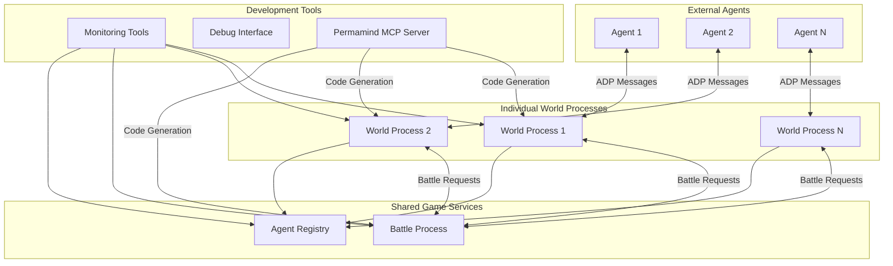
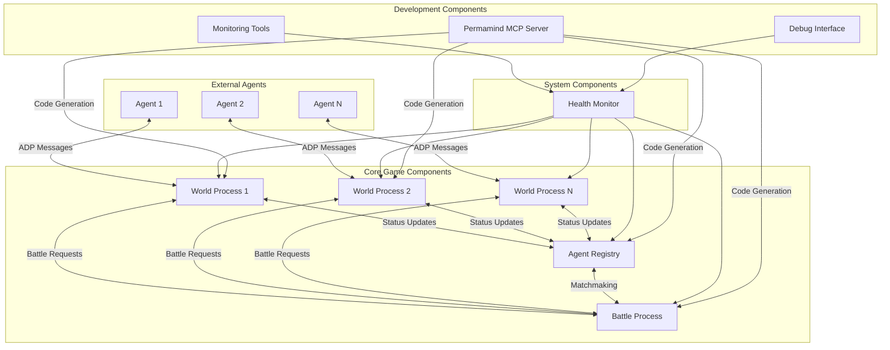
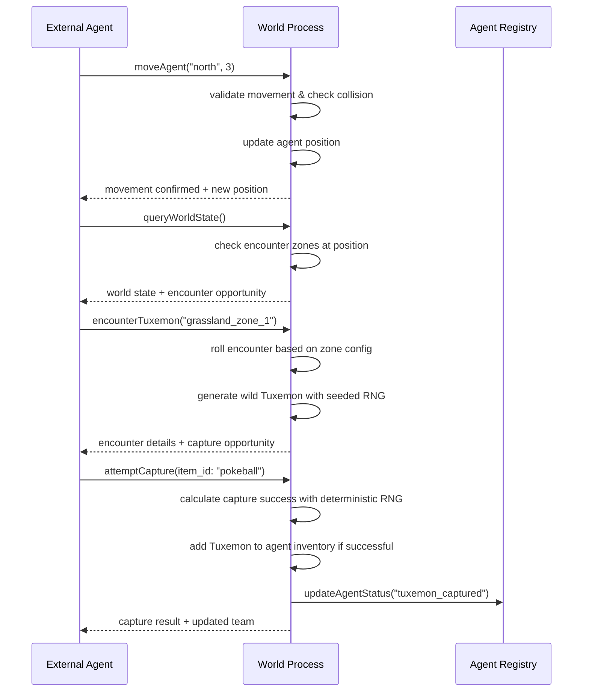
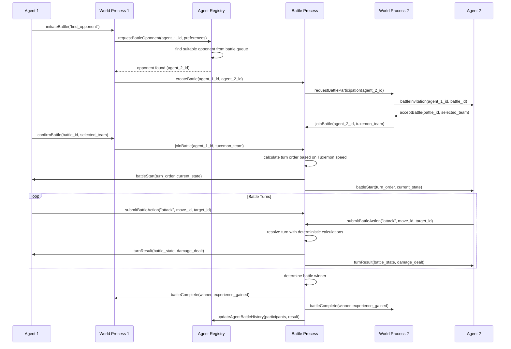

# Tuxemon AO Process Architecture Document

## Introduction

This document outlines the overall project architecture for Tuxemon AO Process, including backend systems, shared services, and non-UI specific concerns. Its primary goal is to serve as the guiding architectural blueprint for AI-driven development, ensuring consistency and adherence to chosen patterns and technologies.

**Relationship to Frontend Architecture:**
If the project includes a significant user interface, a separate Frontend Architecture Document will detail the frontend-specific design and MUST be used in conjunction with this document. Core technology stack choices documented herein (see "Tech Stack") are definitive for the entire project, including any frontend components.

## Starter Template or Existing Project

Based on the PRD analysis and technical requirements, this project builds on existing AO (Arweave Operating System) development patterns with specialized AI-assisted tooling. The technical foundation leverages:

- **Permamind MCP Server**: AI-powered AO development tools including `generateluaprocess`, `queryPermawebdocs`, and other AO domain-specific capabilities for automated code generation and documentation access
- **AO Process Templates**: Standard AO process patterns enhanced by AI-generated handlers and state management logic
- **aolite Testing Framework**: Local development environment for AO process testing and validation
- **ADP v1.0 Compliance**: AO Documentation Protocol v1.0 specification for standardized, self-documenting message interfaces that enable intelligent tool integration and automatic API generation
- **Existing Tuxemon Assets**: Open-source Pokemon-inspired game mechanics and creature data as reference for game logic implementation

The architecture will build upon AO's native process communication patterns enhanced by AI-assisted development workflows. The permamind MCP server operates as a separate development tool alongside aolite, providing:

- **Hybrid Code Generation**: Both full process generation and targeted component creation for game handlers
- **Development-Time Documentation**: Real-time access to Arweave/AO documentation during development phases
- **Parallel Workflow**: MCP server tools complement rather than replace aolite testing environment

This approach enables rapid prototyping of complex game mechanics while maintaining full control over final implementations.

## Change Log
| Date | Version | Description | Author |
|------|---------|-------------|--------|
| 2025-08-23 | v1.0 | Initial architecture document | Winston (Architect Agent) |

## High Level Architecture

### Technical Summary

The Tuxemon AO Process system employs a **process-based microservices architecture** built entirely on Arweave's AO (Arweave Operating System) infrastructure. Individual AO processes handle discrete game systems (world management, battle resolution, agent registration) that communicate via inter-process messages using ADP-compliant JSON protocols. The architecture prioritizes **agent-native design** where autonomous agents interact through structured message handlers rather than traditional user interfaces, enabling complex strategic gameplay through verifiable, persistent on-chain computations. This design directly supports the PRD's goal of creating the first gaming platform specifically optimized for autonomous agent research and competition.

### High Level Overview

**Architectural Style**: **AO Process-Based Microservices**  
Each game system operates as an independent AO process with dedicated state management and message handling capabilities.

**Repository Structure**: **Monorepo** (per PRD)  
All AO processes, shared utilities, testing infrastructure, and development tooling maintained in a single repository for coordinated development and deployment.

**Service Architecture**: **Individual World Instances + Shared Battle Process** (per PRD)
- Separate AO processes for each agent's world state to eliminate concurrency complexity
- Centralized battle resolution process that agents from different worlds connect to for combat
- Event-driven state synchronization between processes using AO's native message passing

**Primary Interaction Flow**:
1. External agents connect to individual world process instances
2. Agents perform movement, exploration, and Tuxemon collection within their world
3. When combat is initiated, agents connect to shared battle process
4. Battle results propagate back to individual world processes for state updates

**Key Architectural Decisions**:
- **Agent-First Design**: All interfaces optimized for programmatic interaction over human-centric UIs
- **Deterministic Gameplay**: All random number generation uses seeded algorithms for agent predictability
- **Persistent Game History**: Complete action history maintained through AO process state persistence
- **Inter-Process Communication**: Native AO message passing rather than external communication protocols

### High Level Project Diagram



### Architectural and Design Patterns

**AO Process Communication Pattern**: Native message passing between AO processes for battle coordination and state synchronization.  
_Rationale:_ Leverages AO's built-in messaging system for reliable inter-process communication without external dependencies.

**Individual Instance Pattern**: Separate world processes per agent to eliminate concurrency complexity.  
_Rationale:_ Simplifies game logic by avoiding multi-agent collision detection and state conflicts within single processes.

**Shared Service Pattern**: Centralized battle process for fair, verifiable combat between agents from different worlds.  
_Rationale:_ Ensures battle fairness and enables cross-world agent competition while maintaining individual world isolation.

**Repository Pattern**: Abstract data access through AO process state management handlers.  
_Rationale:_ Enables consistent state operations and simplifies testing by encapsulating AO-specific state patterns.

**ADP Message Protocol**: Standardized JSON message structures for all external agent interactions.  
_Rationale:_ Provides predictable, documented interfaces that agents can rely on regardless of implementation language.

**Event-Driven State Synchronization**: Asynchronous state updates between processes using AO message events.  
_Rationale:_ Maintains consistency across distributed game processes while supporting agent autonomy and parallel execution.

## Tech Stack

### Cloud Infrastructure
- **Provider:** Arweave/AO Network
- **Key Services:** AO Process Runtime, Arweave Storage, AO Message Router
- **Deployment Regions:** Global (Arweave network nodes)

### Technology Stack Table

| Category | Technology | Version | Purpose | Rationale |
|----------|------------|---------|---------|-----------|
| **Primary Language** | Lua | 5.3+ | AO process handler implementation | Native AO runtime language, optimized for process execution |
| **Process Runtime** | AO (Arweave Operating System) | Latest | Distributed process execution | Provides persistent, verifiable compute with native state management |
| **Message Protocol** | ADP (AO Documentation Protocol) | v1.0 | Self-documenting process interfaces | Enables intelligent tool integration and automatic API discovery through standardized Info handlers |
| **Local Development** | aolite | Latest | AO process testing framework | Enables rapid local iteration before mainnet deployment |
| **AI Code Generation** | Permamind MCP Server | Latest | Lua process generation and tooling | Accelerates development with AO-specific code generation |
| **Development Tools** | Claude Code + MCP | Latest | AI-assisted development environment | Integrated development workflow with specialized AO tooling |
| **State Management** | AO Process State | Native | Persistent game state storage | Built-in AO state persistence eliminates external database needs |
| **Inter-Process Communication** | AO Native Messaging | Native | Process-to-process communication | Leverages AO's built-in message routing for reliable communication |
| **Testing Framework** | aolite + Custom Test Harness | Latest | Unit and integration testing | Local testing environment with mock agent interactions |
| **Documentation** | Markdown + Mermaid | Latest | Architecture and API documentation | Standard documentation format with diagram support |
| **Version Control** | Git | Latest | Source code management | Industry standard for collaborative development |
| **Deployment** | Arweave Network | Native | Process deployment and hosting | Direct deployment to decentralized compute network |

## Data Models

Based on the PRD requirements for turn-based gameplay, Tuxemon collection, and battle mechanics, I've identified the core business entities that will drive our AO process state management:

### Agent

**Purpose:** Represents an external autonomous agent participating in the game ecosystem

**Key Attributes:**
- agent_id: string - Unique identifier for the agent
- world_process_id: string - Reference to agent's individual world process
- active_tuxemon_team: array[6] - Currently active Tuxemon team (max 6 creatures)
- position: {x: number, y: number} - Current world coordinates
- inventory: object - Items and resources owned by agent
- session_state: string - Current game session status (active, battling, idle)
- battle_history: array - Record of previous battles for reputation tracking

**Relationships:**
- Has many Tuxemon (owned creatures)
- Participates in many Battles
- Belongs to one WorldState (individual world instance)

### Tuxemon

**Purpose:** Individual creatures that agents collect, train, and battle with

**Key Attributes:**
- tuxemon_id: string - Unique identifier for this creature instance
- species_id: string - Reference to Tuxemon species template
- owner_agent_id: string - Agent that owns this creature
- level: number - Current experience level
- hp_current: number - Current health points
- hp_max: number - Maximum health points
- attack: number - Attack stat value
- defense: number - Defense stat value
- speed: number - Speed stat value
- status_effects: array - Current battle status effects
- experience_points: number - Total XP earned

**Relationships:**
- Belongs to one Agent (owner)
- Participates in many Battles
- Based on one TuxemonSpecies (template)

### Battle

**Purpose:** Turn-based combat encounters between agents' Tuxemon teams

**Key Attributes:**
- battle_id: string - Unique battle identifier
- participant_agents: array[2] - Two agents participating in battle
- battle_state: string - Current battle phase (setup, active, resolved)
- turn_order: array - Calculated turn sequence based on Tuxemon speed
- current_turn: number - Active turn counter
- battle_log: array - Complete record of all battle actions
- victory_condition: string - How battle was resolved
- winner_agent_id: string - Victorious agent (if resolved)
- random_seed: number - Deterministic seed for battle calculations

**Relationships:**
- Involves many Agents (participants)
- Involves many Tuxemon (active teams)
- Generates many BattleActions (turn log)

### WorldState

**Purpose:** Individual game world instance for a single agent to eliminate concurrency issues

**Key Attributes:**
- world_id: string - Unique world instance identifier
- owner_agent_id: string - Agent that owns this world
- terrain_map: object - 2D tile-based world representation
- npc_positions: object - Non-player character locations
- item_spawns: array - Available items for collection
- encounter_zones: object - Areas where Tuxemon can be found
- world_seed: number - Deterministic seed for world generation
- last_updated: timestamp - State modification timestamp

**Relationships:**
- Belongs to one Agent (owner)
- Contains many ItemSpawns
- Contains many EncounterZones

### TuxemonSpecies

**Purpose:** Static template data defining base characteristics for each Tuxemon species

**Key Attributes:**
- species_id: string - Unique species identifier (e.g., "agnite", "bamboon")
- name: string - Display name of the species
- type_primary: string - Primary elemental type (fire, water, earth, metal, etc.)
- type_secondary: string? - Optional secondary type
- base_stats: object - Base stat template {hp, attack, defense, speed}
- evolution_chain: array - Species this can evolve from/to
- learnable_moves: array - Moves this species can learn by level
- capture_rate: number - Probability modifier for capture attempts
- experience_type: string - XP curve type (fast, medium, slow)
- sprite_assets: object - References to visual assets for display tools

**Relationships:**
- Template for many Tuxemon instances
- Part of SpeciesEvolutionChain

### ItemSpawn

**Purpose:** Represents collectible items available in the world environment

**Key Attributes:**
- spawn_id: string - Unique spawn point identifier
- item_type: string - Type of item (potion, capture_device, food, etc.)
- position: {x: number, y: number} - World coordinates
- respawn_timer: number - Time until item respawns after collection
- spawn_rate: number - Probability of item appearing (0.0-1.0)
- quantity: number - Number of items available at this spawn
- conditions: object - Requirements for spawn activation

**Relationships:**
- Belongs to one WorldState
- References ItemTemplate (static item data)

### EncounterZone

**Purpose:** Defines areas where wild Tuxemon can be encountered and captured

**Key Attributes:**
- zone_id: string - Unique encounter zone identifier
- world_area: object - Rectangular or polygon area definition
- encounter_table: array - Species and their encounter rates
- min_level: number - Minimum level for encountered Tuxemon
- max_level: number - Maximum level for encountered Tuxemon
- encounter_rate: number - Base probability per step/action
- zone_type: string - Environment type (grassland, cave, water, etc.)
- special_conditions: object - Time-based or event-based encounter modifiers

**Relationships:**
- Belongs to one WorldState
- References multiple TuxemonSpecies through encounter table

### BattleAction

**Purpose:** Individual actions taken during battle for complete battle logging

**Key Attributes:**
- action_id: string - Unique action identifier
- battle_id: string - Parent battle reference
- turn_number: number - Which turn this action occurred
- acting_agent_id: string - Agent performing the action
- acting_tuxemon_id: string - Tuxemon performing the action
- action_type: string - Type of action (attack, defend, switch, item, etc.)
- target_tuxemon_id: string? - Target of the action (if applicable)
- move_used: string? - Specific move/attack used
- damage_dealt: number? - Damage amount (if applicable)
- status_effects_applied: array? - Status effects applied by this action
- random_factors: object - All random values used (for deterministic replay)

**Relationships:**
- Belongs to one Battle
- References acting Agent and Tuxemon
- May reference target Tuxemon

### AgentRegistry

**Purpose:** Central registry for agent discovery and battle matchmaking across the system

**Key Attributes:**
- registry_id: string - Unique registry instance identifier
- active_agents: object - Map of agent_id to world_process_id for active agents
- battle_queue: array - Agents seeking battle opponents
- agent_metadata: object - Agent capabilities, preferences, and status information
- matchmaking_rules: object - Configuration for battle pairing algorithms
- last_heartbeat: object - Map of agent_id to last activity timestamp

**Relationships:**
- Tracks many Agents across all world instances
- Facilitates Battle creation between agents

### ProcessHealth

**Purpose:** Monitoring and health status tracking for all AO processes in the system

**Key Attributes:**
- process_id: string - AO process identifier being monitored
- process_type: string - Type of process (world, battle, registry, health)
- status: string - Current health status (healthy, degraded, critical, offline)
- last_heartbeat: timestamp - Most recent health check
- performance_metrics: object - Response times, message throughput, error rates
- resource_usage: object - Memory usage, computational load metrics
- error_log: array - Recent errors and warnings

**Relationships:**
- Monitors all AO processes in the ecosystem
- Referenced by monitoring and debugging tools

### MessageRoute

**Purpose:** State management for inter-process message routing and delivery tracking

**Key Attributes:**
- route_id: string - Unique message route identifier
- source_process_id: string - Originating AO process
- target_process_id: string - Destination AO process
- message_type: string - Type of message being routed
- delivery_status: string - Current delivery state (pending, delivered, failed)
- retry_count: number - Number of delivery attempts
- created_timestamp: timestamp - When route was established
- delivered_timestamp: timestamp? - When message was successfully delivered

**Relationships:**
- Links source and target AO processes
- Tracks message delivery across the system

### ItemTemplate

**Purpose:** Static reference data for all collectible items in the game

**Key Attributes:**
- item_id: string - Unique item type identifier
- name: string - Display name of the item
- category: string - Item category (healing, capture, battle, quest)
- effects: object - Mechanical effects when used
- usage_constraints: object - When/how item can be used
- stack_limit: number - Maximum quantity per inventory slot
- rarity: string - Item rarity classification
- description: string - Item description for agents

**Relationships:**
- Template for ItemSpawn instances
- Referenced by Agent inventory systems

### MoveTemplate

**Purpose:** Static reference data for all Tuxemon moves and abilities

**Key Attributes:**
- move_id: string - Unique move identifier
- name: string - Display name of the move
- type: string - Elemental type of the move
- category: string - Move category (physical, special, status)
- base_power: number - Base damage value
- accuracy: number - Hit chance percentage
- pp_cost: number - Power points consumed per use
- target_type: string - Who can be targeted (self, enemy, ally, all)
- effects: array - Status effects or special mechanics
- learn_requirements: object - Level or conditions needed to learn

**Relationships:**
- Referenced by TuxemonSpecies.learnable_moves
- Used in BattleAction.move_used tracking

## Components

Based on our AO process-based microservices architecture and the data models above, the system is organized into discrete AO process components that handle specific game responsibilities while maintaining clear boundaries and interfaces.

### World Process

**Responsibility:** Manages individual agent world instances including movement, exploration, Tuxemon encounters, and item collection within a private game environment.

**Key Interfaces:**
- `moveAgent(direction, steps)` - Handle agent movement with collision detection
- `queryWorldState()` - Return current world state, nearby objects, and available actions
- `encounterTuxemon(zone_id)` - Initiate wild Tuxemon encounter based on zone configuration
- `collectItem(item_spawn_id)` - Handle item collection and inventory updates
- `initiateBattle(target_agent_id)` - Request battle with another agent via battle process

**Dependencies:** 
- Battle Process (for cross-world combat initiation)
- Agent Registry (for agent discovery and status updates)

**Technology Stack:** 
- Lua 5.3+ for AO process handlers
- AO Process State for persistent world data storage
- ADP v1.0 compliant message interfaces for external agent communication

### Battle Process

**Responsibility:** Manages turn-based combat between agents from different world instances, ensuring fair and verifiable battle resolution with complete action logging.

**Key Interfaces:**
- `joinBattle(agent_id, tuxemon_team)` - Add agent to battle with selected Tuxemon team
- `submitBattleAction(action_type, move_id, target_id)` - Process agent combat actions
- `getBattleState()` - Return current battle status, turn order, and available actions
- `resolveTurn()` - Execute all submitted actions and calculate battle outcomes
- `completeBattle()` - Finalize battle results and update agent world processes

**Dependencies:** 
- World Processes (for agent team data and result propagation)
- Agent Registry (for participant validation)

**Technology Stack:** 
- Lua 5.3+ with deterministic random number generation for fair combat
- AO Process State for battle state persistence and action logging
- Inter-process AO messaging for world state synchronization

### Agent Registry Process

**Responsibility:** Central registry for agent discovery, battle matchmaking, and system-wide agent status tracking across all world instances.

**Key Interfaces:**
- `registerAgent(agent_id, world_process_id, capabilities)` - Register new agent in system
- `findBattleOpponent(agent_id, preferences)` - Matchmaking for battle requests
- `updateAgentStatus(agent_id, status)` - Update agent activity and availability
- `queryActiveAgents()` - List all active agents and their world processes
- `getAgentMetadata(agent_id)` - Retrieve agent capabilities and battle history

**Dependencies:** 
- World Processes (for agent status updates)
- Battle Process (for battle coordination)

**Technology Stack:** 
- Lua 5.3+ for registry management and matchmaking algorithms
- AO Process State for agent tracking and metadata storage
- AO Native Messaging for cross-process agent status synchronization

### Health Monitor Process

**Responsibility:** System-wide health monitoring and performance tracking for all AO processes, providing debugging interfaces and operational visibility.

**Key Interfaces:**
- `healthCheck(process_id)` - Perform health check on specified process
- `getSystemStatus()` - Return overall system health and performance metrics
- `logError(process_id, error_details)` - Record process errors and warnings
- `getPerformanceMetrics(time_range)` - Retrieve system performance data
- `processHeartbeat(process_id, metrics)` - Receive periodic process status updates

**Dependencies:** 
- All other processes (for monitoring and health checks)

**Technology Stack:** 
- Lua 5.3+ for health monitoring logic and metrics collection
- AO Process State for health data persistence and historical tracking
- Development tools integration for debugging interface access

### Component Diagrams



## Core Workflows

The following sequence diagrams illustrate key system workflows that clarify component interactions and complex processes:

### Agent World Exploration and Tuxemon Encounter



### Cross-World Battle Initiation and Resolution



## Database Schema

Since our tech stack uses AO Process State for data persistence rather than traditional databases, our "schema" consists of JSON data structures stored within each AO process:

### World Process State Structure

```json
{
  "world_id": "world_001",
  "owner_agent_id": "agent_123",
  "terrain_map": {
    "width": 100,
    "height": 100,
    "tiles": [
      {"x": 0, "y": 0, "type": "grass", "passable": true},
      {"x": 1, "y": 0, "type": "water", "passable": false}
    ]
  },
  "agent_state": {
    "agent_id": "agent_123",
    "position": {"x": 50, "y": 50},
    "active_tuxemon_team": ["tux_001", "tux_002"],
    "inventory": {
      "items": [
        {"item_id": "potion", "quantity": 5},
        {"item_id": "pokeball", "quantity": 10}
      ]
    },
    "owned_tuxemon": {
      "tux_001": {
        "tuxemon_id": "tux_001",
        "species_id": "agnite",
        "level": 12,
        "hp_current": 45,
        "hp_max": 45,
        "stats": {"attack": 28, "defense": 22, "speed": 18},
        "experience_points": 1250
      }
    }
  },
  "encounter_zones": [
    {
      "zone_id": "grassland_1",
      "area": {"x": 40, "y": 40, "width": 20, "height": 20},
      "encounter_table": [
        {"species_id": "agnite", "rate": 0.4, "min_level": 8, "max_level": 15},
        {"species_id": "bamboon", "rate": 0.3, "min_level": 10, "max_level": 18}
      ]
    }
  ],
  "item_spawns": [
    {
      "spawn_id": "item_spawn_001",
      "item_type": "potion",
      "position": {"x": 25, "y": 75},
      "respawn_timer": 3600,
      "available": true
    }
  ],
  "world_seed": 987654321,
  "last_updated": "2025-08-23T10:30:00Z"
}
```

### Battle Process State Structure

```json
{
  "battle_id": "battle_456",
  "participants": ["agent_123", "agent_789"],
  "battle_state": "active",
  "current_turn": 3,
  "turn_order": [
    {"agent_id": "agent_789", "tuxemon_id": "tux_003", "speed": 35},
    {"agent_id": "agent_123", "tuxemon_id": "tux_001", "speed": 18}
  ],
  "participant_teams": {
    "agent_123": [
      {
        "tuxemon_id": "tux_001",
        "species_id": "agnite",
        "hp_current": 30,
        "hp_max": 45,
        "status_effects": ["burned"]
      }
    ],
    "agent_789": [
      {
        "tuxemon_id": "tux_003",
        "species_id": "bamboon",
        "hp_current": 52,
        "hp_max": 60,
        "status_effects": []
      }
    ]
  },
  "battle_log": [
    {
      "action_id": "action_001",
      "turn_number": 1,
      "acting_agent_id": "agent_789",
      "action_type": "attack",
      "move_used": "flame_burst",
      "target_tuxemon_id": "tux_001",
      "damage_dealt": 15,
      "random_factors": {"critical_hit_roll": 0.85, "damage_variance": 0.92}
    }
  ],
  "random_seed": 123456789,
  "created_timestamp": "2025-08-23T10:15:00Z"
}
```

### Agent Registry State Structure

```json
{
  "registry_id": "main_registry",
  "active_agents": {
    "agent_123": {
      "world_process_id": "world_001",
      "status": "active",
      "last_heartbeat": "2025-08-23T10:30:00Z",
      "capabilities": ["battle", "exploration", "collection"],
      "battle_preferences": {
        "max_level_difference": 5,
        "preferred_battle_types": ["standard", "tournament"]
      }
    }
  },
  "battle_queue": [
    {
      "agent_id": "agent_456",
      "queue_timestamp": "2025-08-23T10:28:00Z",
      "preferences": {"max_level_difference": 3}
    }
  ],
  "matchmaking_rules": {
    "level_tolerance": 5,
    "queue_timeout": 300,
    "min_active_time": 60
  }
}

## Source Tree

Based on our monorepo structure and AO process-based microservices architecture:

```
tuxemon-ao-process/
├── ao-processes/                   # AO process implementations
│   ├── world/                      # Individual world process
│   │   ├── src/
│   │   │   ├── handlers/
│   │   │   │   ├── movement.tl     # Agent movement and collision
│   │   │   │   ├── encounters.tl   # Tuxemon encounter mechanics
│   │   │   │   ├── items.tl        # Item collection and inventory
│   │   │   │   └── world-state.tl  # World state queries
│   │   │   ├── utils/
│   │   │   │   ├── collision.tl    # Collision detection utilities
│   │   │   │   ├── seeded-rng.tl   # Deterministic random generation
│   │   │   │   └── state-manager.tl # World state persistence
│   │   │   └── main.tl             # Process entry point and routing
│   │   ├── package.json
│   │   └── tlconfig.lua            # Teal configuration
│   ├── battle/                     # Shared battle process
│   │   ├── src/
│   │   │   ├── handlers/
│   │   │   │   ├── battle-setup.tl    # Battle initialization
│   │   │   │   ├── turn-resolution.tl  # Combat mechanics
│   │   │   │   ├── damage-calc.tl      # Damage calculations
│   │   │   │   └── battle-end.tl       # Battle completion
│   │   │   ├── utils/
│   │   │   │   ├── move-effects.tl     # Move and status effects
│   │   │   │   ├── type-effectiveness.tl # Elemental type system
│   │   │   │   └── battle-logger.tl    # Action logging
│   │   │   └── main.tl
│   │   ├── package.json
│   │   └── tlconfig.lua
│   ├── registry/                   # Agent registry process
│   │   ├── src/
│   │   │   ├── handlers/
│   │   │   │   ├── agent-registration.tl # Agent discovery
│   │   │   │   ├── matchmaking.tl        # Battle opponent matching
│   │   │   │   └── status-tracking.tl    # Agent status updates
│   │   │   ├── utils/
│   │   │   │   └── matching-algorithm.tl # Matchmaking logic
│   │   │   └── main.tl
│   │   ├── package.json
│   │   └── tlconfig.lua
│   └── health-monitor/             # System monitoring process
│       ├── src/
│       │   ├── handlers/
│       │   │   ├── health-check.tl      # Process health monitoring
│       │   │   ├── metrics-collection.tl # Performance tracking
│       │   │   └── error-logging.tl     # Error aggregation
│       │   ├── utils/
│       │   │   └── monitoring-utils.tl  # Health check utilities
│       │   └── main.tl
│       ├── package.json
│       └── tlconfig.lua
├── shared/                         # Shared utilities and types
│   ├── types/
│   │   ├── agent.d.tl              # Agent data types
│   │   ├── tuxemon.d.tl            # Tuxemon data types
│   │   ├── battle.d.tl             # Battle data types
│   │   └── world.d.tl              # World data types
│   ├── utils/
│   │   ├── adp-validation.tl       # ADP message validation
│   │   ├── error-handling.tl       # Standardized error handling
│   │   └── json-utils.tl           # JSON serialization utilities
│   └── data/
│       ├── tuxemon-species.json    # Static species reference data
│       ├── move-templates.json     # Static move reference data
│       └── item-templates.json     # Static item reference data
├── scripts/                        # Development and deployment scripts
│   ├── build-all.js                # Build all AO processes
│   ├── deploy-local.js             # Local aolite deployment
│   ├── deploy-mainnet.js           # Mainnet deployment
│   └── test-runner.js              # Test execution coordination
├── tests/                          # Testing infrastructure
│   ├── unit/                       # Unit tests for individual processes
│   │   ├── world/
│   │   ├── battle/
│   │   ├── registry/
│   │   └── health-monitor/
│   ├── integration/                # Inter-process integration tests
│   │   ├── battle-workflow.test.js
│   │   ├── agent-registration.test.js
│   │   └── world-exploration.test.js
│   └── mock-agents/                # Mock external agents for testing
│       ├── basic-explorer.js
│       ├── battle-seeker.js
│       └── tuxemon-collector.js
├── development/                    # Development and monitoring tools
│   ├── monitoring-dashboard/       # Process health visualization
│   ├── debug-interface/            # Interactive debugging tools
│   └── agent-simulator/            # Agent behavior simulation
├── docs/                          # Documentation
│   ├── architecture.md            # This document
│   ├── api-reference.md           # ADP message specifications
│   └── development-guide.md       # Developer onboarding
├── package.json                   # Root monorepo configuration
└── README.md                      # Project overview and setup
```

## Infrastructure and Deployment

### Infrastructure as Code
- **Tool:** Native AO Process Deployment (no traditional IaC required)
- **Location:** `scripts/` directory for deployment automation
- **Approach:** Direct deployment to Arweave/AO network using AO-specific tooling

### Deployment Strategy
- **Strategy:** Direct AO Process Deployment with aolite local testing
- **CI/CD Platform:** GitHub Actions with AO deployment integration
- **Pipeline Configuration:** `.github/workflows/` for automated testing and deployment

### Environments
- **Development:** Local aolite simulation environment for rapid iteration
- **Testing:** Dedicated AO testnet processes for integration validation  
- **Production:** Mainnet AO processes for live agent interactions

### Environment Promotion Flow
```
Local aolite → Testnet AO → Mainnet AO
     ↓              ↓            ↓
Unit Tests → Integration → Live Agents
```

### Rollback Strategy
- **Primary Method:** AO Process State Snapshots with rollback capability
- **Trigger Conditions:** Health check failures, performance degradation, agent interaction errors
- **Recovery Time Objective:** < 5 minutes for critical processes

## Error Handling Strategy

### General Approach
- **Error Model:** ADP-compliant error responses with structured error codes
- **Exception Hierarchy:** Process-specific error types with standardized format
- **Error Propagation:** Local process error handling with inter-process error notification

### Logging Standards
- **Library:** Native AO Process Logging
- **Format:** Structured JSON logging for agent analysis and debugging
- **Levels:** ERROR, WARN, INFO, DEBUG with process-specific context
- **Required Context:**
  - Correlation ID: `${process_id}_${timestamp}_${sequence}`
  - Service Context: Process type, handler name, operation
  - Agent Context: Agent ID and session information (never sensitive data)

### Error Handling Patterns

#### External Agent Communication Errors
- **Retry Policy:** Exponential backoff for temporary failures (network, rate limits)
- **Circuit Breaker:** Disable problematic agents after repeated failures
- **Timeout Configuration:** 2-second handler timeout per NFR requirements
- **Error Translation:** Convert AO internal errors to agent-friendly ADP responses

#### Business Logic Errors  
- **Custom Exceptions:** Game-specific error types (InvalidMove, TuxemonNotFound, BattleInProgress)
- **User-Facing Errors:** Clear, actionable error messages for agent developers
- **Error Codes:** Structured error code system (WORLD_001, BATTLE_002, etc.)

#### Data Consistency
- **Transaction Strategy:** AO Process atomic state updates with rollback capability
- **Compensation Logic:** Battle result compensation if process failures occur
- **Idempotency:** All message handlers support safe retry without side effects

## Coding Standards

These standards are MANDATORY for AI agents and human developers. Focus on project-specific conventions that prevent common mistakes:

### Core Standards
- **Languages & Runtimes:** Lua 5.3+ for AO processes, JavaScript for tooling and tests
- **Style & Linting:** Teal type checking for Lua code, ESLint for JavaScript components
- **Test Organization:** `*.test.tl` for Lua tests, `*.test.js` for JavaScript integration tests

### Critical Rules
- **No console.log in AO processes:** Use structured logging via AO process logging only
- **All message handlers must validate ADP compliance:** Use `shared/utils/adp-validation.tl` for all external messages
- **Deterministic random generation required:** Always use seeded RNG from `shared/utils/seeded-rng.tl`, never Lua's math.random()
- **State mutations must be atomic:** All AO process state changes within single handler execution
- **Agent data isolation:** World processes must never access other agents' data directly

## Security

Implementation-specific security requirements for AO process development:

### Input Validation
- **Validation Library:** Custom ADP validation in `shared/utils/adp-validation.tl`
- **Validation Location:** All external message handlers must validate before processing
- **Required Rules:**
  - All agent messages MUST be validated against ADP v1.0 specification
  - Numeric inputs must have range validation (position coordinates, damage values, etc.)
  - String inputs must have length limits and character whitelisting

### Authentication & Authorization  
- **Auth Method:** AO Process message sender verification (built-in AO capability)
- **Session Management:** Agent session state tracked in individual world processes
- **Required Patterns:**
  - Verify message sender matches registered agent ID for all operations
  - Validate agent ownership before accessing Tuxemon or inventory data

### Secrets Management
- **Development:** No secrets required for local aolite development
- **Production:** AO process deployment keys managed via deployment scripts
- **Code Requirements:**
  - No hardcoded process IDs or agent identifiers
  - Configuration via process initialization messages only
  - No sensitive game data in error messages or logs

### Data Protection
- **Agent Data Isolation:** Each world process stores only single agent's data
- **Battle Privacy:** Battle process purges detailed logs after completion
- **PII Handling:** No personally identifiable information stored in any process
- **Logging Restrictions:** Never log agent strategies, detailed battle plans, or sensitive game state

### Dependency Security
- **AO Process Dependencies:** Only use verified AO-compatible Lua libraries
- **JavaScript Dependencies:** Regular npm audit for tooling and test dependencies
- **Update Policy:** Monthly dependency updates with testing validation

## AO Documentation Protocol (ADP) v1.0 Compliance

### Overview

All AO processes in the Tuxemon platform MUST implement ADP v1.0 compliance to ensure self-documenting, intelligent tool integration capabilities. ADP v1.0 enables automatic UI generation, real-time tag validation, and dynamic interface discovery without requiring separate API documentation.

### Required Handlers

Every AO process MUST implement these standardized handlers:

#### Info Handler
**Action:** `Info`  
**Purpose:** Provides comprehensive process metadata, capabilities, and handler definitions

**Response Format:**
```json
{
  "Name": "Process Name",
  "Process": "process_id", 
  "protocolVersion": "1.0",
  "lastUpdated": timestamp,
  "handlers": [
    {
      "action": "Handler-Name",
      "pattern": "Action", 
      "description": "Handler description",
      "category": "core|utility|custom",
      "version": "1.0",
      "tags": [
        {
          "name": "TagName",
          "type": "string|number|boolean|address|json",
          "required": true|false,
          "description": "Tag description",
          "examples": ["example1", "example2"]
        }
      ]
    }
  ],
  "capabilities": ["capability1", "capability2"],
  "state": {
    "status": "healthy",
    "uptime": seconds,
    "timestamp": current_time,
    "statistics": {...}
  }
}
```

#### Help Handler
**Action:** `Help`  
**Purpose:** Provides interactive documentation and usage guidance

#### Get-Metadata Handler  
**Action:** `Get-Metadata`
**Purpose:** Returns handler registry and capability information

#### Get-Schema Handler
**Action:** `Get-Schema`
**Purpose:** Exports OpenAPI-style schema for external documentation tools

### Implementation Requirements

1. **Handler Metadata Registration:**
   - Use `HandlerMetadata.register_handler()` for all process handlers
   - Include comprehensive tag definitions with validation rules
   - Provide examples for all required and optional parameters

2. **Validation Integration:**
   - Apply `ADPValidator.validate_message()` to all external message handlers  
   - Use standardized error responses with proper error codes
   - Implement input sanitization and range checking

3. **Response Format:**
   - All responses MUST use `ProcessBase.create_adp_response()` wrapper
   - Include proper ADP headers: `ADP-Version: "1.0"`, `Content-Type: "application/json"`
   - Use consistent error response format across all handlers

4. **Documentation Generation:**
   - Handlers MUST be self-documenting through metadata
   - No separate API documentation required
   - Tool integration through standardized schema export

### File Locations
- **Framework:** `shared/utils/adp-validation.tl`, `shared/utils/handler-metadata.tl`
- **Process Implementation:** Each process's `main.lua` Info handler
- **Testing:** `tests/integration/info-handler-compliance.test.js`

### Compliance Testing
Regular compliance testing ensures all processes maintain ADP v1.0 standards:
- Automated checks for required handler presence
- Response format validation  
- Schema structure verification
- Handler metadata completeness

## Next Steps

After completing this architecture document:

1. **Begin Implementation with AI-Assisted Development:**
   - Use permamind MCP Server tools for initial AO process generation
   - Start with World Process as it has the most complex game logic
   - Leverage AI code generation for battle mechanics and deterministic systems

2. **Set up Development Environment:**
   - Configure aolite local testing environment
   - Implement basic mock agents for testing
   - Set up CI/CD pipeline with GitHub Actions

3. **Iterative Development Approach:**
   - Epic 1: Foundation & Core Infrastructure (health checks, basic handlers)
   - Epic 2: Observability & Developer Tooling (monitoring, debugging interfaces)  
   - Epic 3: Agent World Management (movement, encounters, state management)
   - Epic 4: Tuxemon Collection System (creature mechanics, inventory)
   - Epic 5: Battle Resolution Engine (turn-based combat, cross-world battles)

**Architecture Document Status: ✅ COMPLETE**

This architecture provides the definitive technical blueprint for building the Tuxemon AO Process autonomous agent gaming platform. All subsequent development must reference and follow the patterns, technologies, and standards defined in this document.