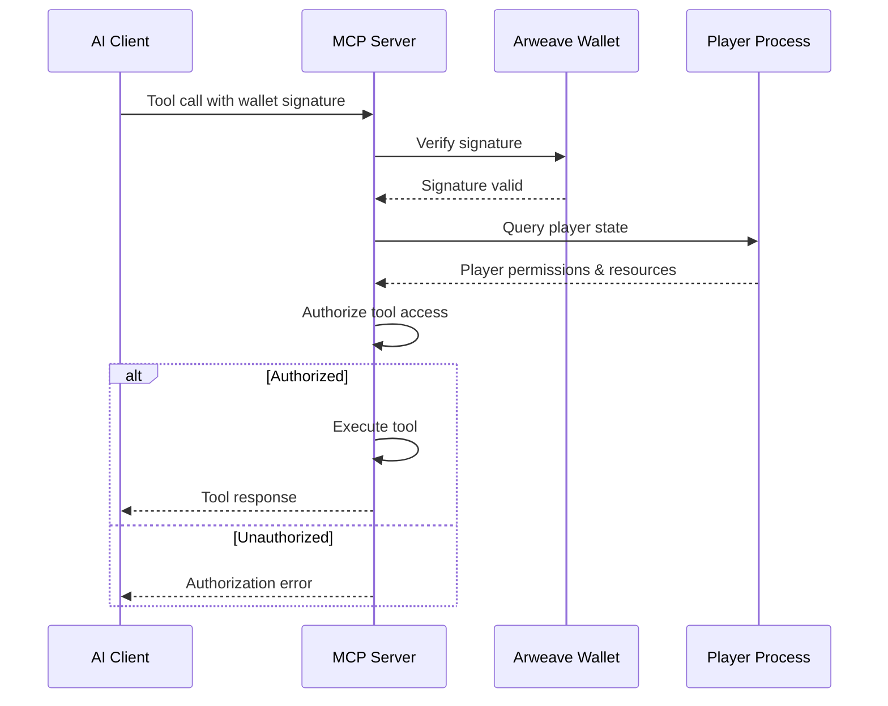

# Backend Architecture

## Service Architecture

PrimalCode uses a **hybrid serverless + AO process architecture**:

### Function Organization
```
src/
├── tools/                    # MCP tool implementations (serverless functions)
│   ├── ecosystem-observer.ts
│   ├── environment-modifier.ts
│   └── monster-analyzer.ts
├── ao-integration/          # AO process communication layer
│   ├── ao-client.ts
│   ├── message-schemas.ts
│   ├── process-manager.ts
│   └── teal-process-client.ts
└── ecosystem/              # Game logic and state management
    ├── monster-state.ts
    ├── environment-state.ts
    └── game-logic.ts
```

### Function Template
```typescript
// MCP Tool Function Pattern
export async function observeEcosystemHandler(request: MCPToolRequest): Promise<MCPToolResponse> {
  try {
    // Validate request and extract parameters
    const params = validateObserveEcosystemParams(request.params);
    
    // Initialize AO client connection
    const aoClient = new AOClient(params.playerWallet);
    
    // Query current ecosystem state
    const environment = await aoClient.queryEnvironment(params.route_id);
    const monsters = await aoClient.queryMonsters(params.route_id);
    
    // Generate natural language response
    const narrative = await generateEcosystemNarrative(environment, monsters, params.focus);
    
    return {
      content: [{
        type: "text",
        text: narrative.description
      }],
      isError: false
    };
  } catch (error) {
    return {
      content: [{
        type: "text", 
        text: `Error observing ecosystem: ${error.message}`
      }],
      isError: true
    };
  }
}
```

## Database Architecture

### Schema Design
```teal
-- AO Process Schema (Teal type definitions)

-- Monster Process Schema
local monster_schema: MonsterSchema = {
  id = "string",
  species = "string",
  stats = {
    health = "number",
    hunger = "number", 
    energy = "number",
    position = {
      x = "number",
      y = "number",
      route = "string"
    }
  },
  ai_personality = {
    aggression = "number",
    intelligence = "number",
    pack_tendency = "number"
  },
  environmental_awareness = {
    detected_structures = "table",
    resource_memory = "table",
    weather_adaptation = "number"
  },
  influence_resistance = {
    learned_patterns = "table",
    adaptation_history = "table"
  },
  state = "string",
  last_decision = "number"
}

-- Environment Process Schema
local environment_schema: EnvironmentSchema = {
  route_id = "string",
  structures = "table",
  resources = "table", 
  weather_state = {
    condition = "string",
    temperature = "number",
    humidity = "number"
  },
  ecosystem_balance = "number",
  last_modified = "number"
}
```

### Data Access Layer
```typescript
// Repository Pattern for Teal AO Process Access
export class TealMonsterRepository {
  constructor(private tealClient: TealProcessClient) {}
  
  async findById(monsterId: string): Promise<Monster | null> {
    try {
      const process = await this.tealClient.getProcess(monsterId);
      const result = await process.dryRun({
        Action: "Get-State",
        Data: { query: "full_state" }
      });
      
      return this.deserializeMonster(result.Messages[0].Data);
    } catch (error) {
      console.error(`Error fetching monster ${monsterId}:`, error);
      return null;
    }
  }
  
  async updateState(monsterId: string, stateUpdate: Partial<Monster>): Promise<void> {
    const process = await this.tealClient.getProcess(monsterId);
    await process.message({
      Action: "Update-State",
      Data: stateUpdate
    });
  }
  
  async findByRoute(routeId: string): Promise<Monster[]> {
    const monsters = await this.tealClient.queryProcessesByTag("route", routeId);
    return Promise.all(monsters.map(id => this.findById(id)));
  }
}
```

## Authentication and Authorization

### Auth Flow


### Auth Middleware
```typescript
// Authentication and Authorization Middleware
export class AuthMiddleware {
  async validateWalletSignature(signature: string, message: string, address: string): Promise<boolean> {
    try {
      const arweave = Arweave.init({});
      const publicKey = await arweave.wallets.getPublicKey(address);
      
      const isValid = await arweave.crypto.verify(
        publicKey,
        message,
        signature
      );
      
      return isValid;
    } catch (error) {
      console.error('Signature validation failed:', error);
      return false;
    }
  }
  
  async authorizeToolAccess(walletAddress: string, toolName: string): Promise<AuthResult> {
    const player = await this.getPlayerState(walletAddress);
    
    if (!player) {
      return { authorized: false, reason: "Player not found" };
    }
    
    if (!player.unlocked_tools.includes(toolName)) {
      return { authorized: false, reason: "Tool not unlocked" };
    }
    
    const toolCost = this.getToolCost(toolName);
    if (player.influence_points < toolCost) {
      return { authorized: false, reason: "Insufficient influence points" };
    }
    
    return { authorized: true };
  }
}
```
