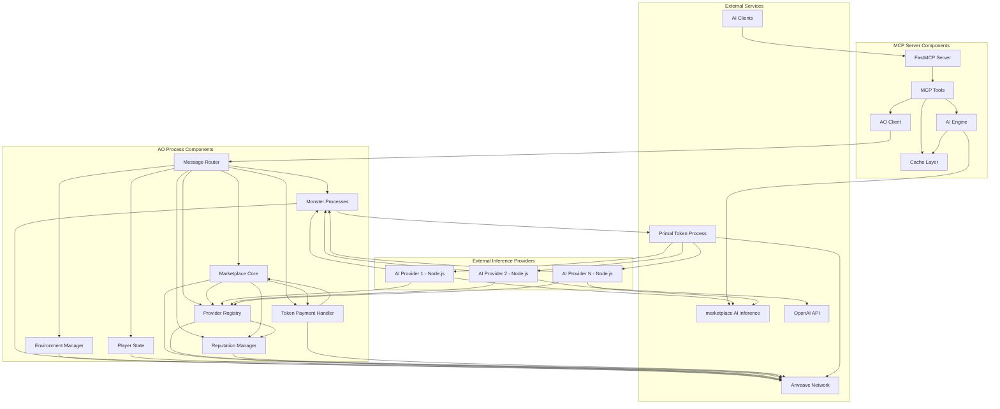

# Components Diagrams

```mermaid
graph TB
    subgraph "MCP Server Components"
        MCP[FastMCP Server]
        TOOLS[MCP Tools]
        AOC[AO Client]
        AI[AI Engine]
        CACHE[Cache Layer]
    end
    
    subgraph "AO Process Components"
        MP[Monster Processes]
        ENV[Environment Manager]
        PLY[Player State]
        MARKETPLACE[Marketplace Core]
        REGISTRY[Provider Registry]
        REPUTATION[Reputation Manager]
        TOKEN[Token Payment Handler]
        MSG[Message Router]
    end
    
    subgraph "External Inference Providers"
        PROVIDER1[AI Provider 1 - Node.js]
        PROVIDER2[AI Provider 2 - Node.js]
        PROVIDER3[AI Provider N - Node.js]
    end
    
    subgraph "External Services"
        CLAUDE[marketplace AI inference]
        OPENAI[OpenAI API]
        ARWEAVE[Arweave Network]
        CLIENTS[AI Clients]
        PRIMAL_TOKEN[Primal Token Process]
    end
    
    CLIENTS --> MCP
    MCP --> TOOLS
    TOOLS --> AOC
    TOOLS --> AI
    TOOLS --> CACHE
    
    AOC --> MSG
    MSG --> MP
    MSG --> ENV
    MSG --> PLY
    MSG --> MARKETPLACE
    MSG --> REGISTRY
    MSG --> REPUTATION
    MSG --> TOKEN
    
    AI --> CLAUDE
    AI --> CACHE
    
    MARKETPLACE --> REGISTRY
    MARKETPLACE --> REPUTATION
    MARKETPLACE --> TOKEN
    REGISTRY --> REPUTATION
    TOKEN --> MARKETPLACE
    
    %% Token Payment Flow
    MP --> PRIMAL_TOKEN
    PRIMAL_TOKEN --> PROVIDER1
    PRIMAL_TOKEN --> PROVIDER2
    PRIMAL_TOKEN --> PROVIDER3
    
    %% Inference Provider Connections
    PROVIDER1 --> CLAUDE
    PROVIDER2 --> OPENAI
    PROVIDER3 --> CLAUDE
    
    PROVIDER1 --> REGISTRY
    PROVIDER2 --> REGISTRY
    PROVIDER3 --> REGISTRY
    
    PROVIDER1 --> MP
    PROVIDER2 --> MP
    PROVIDER3 --> MP
    
    MP --> ARWEAVE
    ENV --> ARWEAVE
    PLY --> ARWEAVE
    MARKETPLACE --> ARWEAVE
    REGISTRY --> ARWEAVE
    REPUTATION --> ARWEAVE
    TOKEN --> ARWEAVE
    PRIMAL_TOKEN --> ARWEAVE
```
