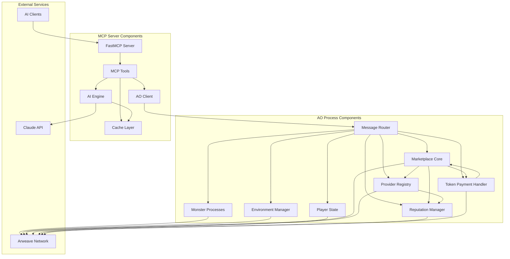

# Components Diagrams

```mermaid
graph TB
    subgraph "MCP Server Components"
        MCP[FastMCP Server]
        TOOLS[MCP Tools]
        AOC[AO Client]
        AI[AI Engine]
        CACHE[Cache Layer]
    end
    
    subgraph "AO Process Components"
        MP[Monster Processes]
        ENV[Environment Manager]
        PLY[Player State]
        MARKETPLACE[Marketplace Core]
        REGISTRY[Provider Registry]
        REPUTATION[Reputation Manager]
        TOKEN[Token Payment Handler]
        MSG[Message Router]
    end
    
    subgraph "External Services"
        CLAUDE[Claude API]
        ARWEAVE[Arweave Network]
        CLIENTS[AI Clients]
    end
    
    CLIENTS --> MCP
    MCP --> TOOLS
    TOOLS --> AOC
    TOOLS --> AI
    TOOLS --> CACHE
    
    AOC --> MSG
    MSG --> MP
    MSG --> ENV
    MSG --> PLY
    MSG --> MARKETPLACE
    MSG --> REGISTRY
    MSG --> REPUTATION
    MSG --> TOKEN
    
    AI --> CLAUDE
    AI --> CACHE
    
    MARKETPLACE --> REGISTRY
    MARKETPLACE --> REPUTATION
    MARKETPLACE --> TOKEN
    REGISTRY --> REPUTATION
    TOKEN --> MARKETPLACE
    
    MP --> ARWEAVE
    ENV --> ARWEAVE
    PLY --> ARWEAVE
    MARKETPLACE --> ARWEAVE
    REGISTRY --> ARWEAVE
    REPUTATION --> ARWEAVE
    TOKEN --> ARWEAVE
```
