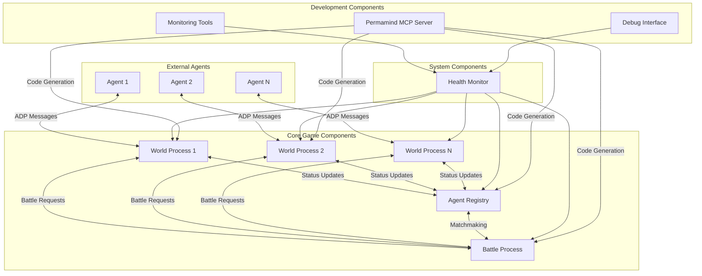

# Components

Based on our AO process-based microservices architecture and the data models above, the system is organized into discrete AO process components that handle specific game responsibilities while maintaining clear boundaries and interfaces.

## World Process

**Responsibility:** Manages individual agent world instances including movement, exploration, Tuxemon encounters, and item collection within a private game environment.

**Key Interfaces:**
- `moveAgent(direction, steps)` - Handle agent movement with collision detection
- `queryWorldState()` - Return current world state, nearby objects, and available actions
- `encounterTuxemon(zone_id)` - Initiate wild Tuxemon encounter based on zone configuration
- `collectItem(item_spawn_id)` - Handle item collection and inventory updates
- `initiateBattle(target_agent_id)` - Request battle with another agent via battle process

**Dependencies:** 
- Battle Process (for cross-world combat initiation)
- Agent Registry (for agent discovery and status updates)

**Technology Stack:** 
- Lua 5.3+ for AO process handlers
- AO Process State for persistent world data storage
- ADP v1.0 compliant message interfaces for external agent communication

## Battle Process

**Responsibility:** Manages turn-based combat between agents from different world instances, ensuring fair and verifiable battle resolution with complete action logging.

**Key Interfaces:**
- `joinBattle(agent_id, tuxemon_team)` - Add agent to battle with selected Tuxemon team
- `submitBattleAction(action_type, move_id, target_id)` - Process agent combat actions
- `getBattleState()` - Return current battle status, turn order, and available actions
- `resolveTurn()` - Execute all submitted actions and calculate battle outcomes
- `completeBattle()` - Finalize battle results and update agent world processes

**Dependencies:** 
- World Processes (for agent team data and result propagation)
- Agent Registry (for participant validation)

**Technology Stack:** 
- Lua 5.3+ with deterministic random number generation for fair combat
- AO Process State for battle state persistence and action logging
- Inter-process AO messaging for world state synchronization

## Agent Registry Process

**Responsibility:** Central registry for agent discovery, battle matchmaking, and system-wide agent status tracking across all world instances.

**Key Interfaces:**
- `registerAgent(agent_id, world_process_id, capabilities)` - Register new agent in system
- `findBattleOpponent(agent_id, preferences)` - Matchmaking for battle requests
- `updateAgentStatus(agent_id, status)` - Update agent activity and availability
- `queryActiveAgents()` - List all active agents and their world processes
- `getAgentMetadata(agent_id)` - Retrieve agent capabilities and battle history

**Dependencies:** 
- World Processes (for agent status updates)
- Battle Process (for battle coordination)

**Technology Stack:** 
- Lua 5.3+ for registry management and matchmaking algorithms
- AO Process State for agent tracking and metadata storage
- AO Native Messaging for cross-process agent status synchronization

## Health Monitor Process

**Responsibility:** System-wide health monitoring and performance tracking for all AO processes, providing debugging interfaces and operational visibility.

**Key Interfaces:**
- `healthCheck(process_id)` - Perform health check on specified process
- `getSystemStatus()` - Return overall system health and performance metrics
- `logError(process_id, error_details)` - Record process errors and warnings
- `getPerformanceMetrics(time_range)` - Retrieve system performance data
- `processHeartbeat(process_id, metrics)` - Receive periodic process status updates

**Dependencies:** 
- All other processes (for monitoring and health checks)

**Technology Stack:** 
- Lua 5.3+ for health monitoring logic and metrics collection
- AO Process State for health data persistence and historical tracking
- Development tools integration for debugging interface access

## Component Diagrams

