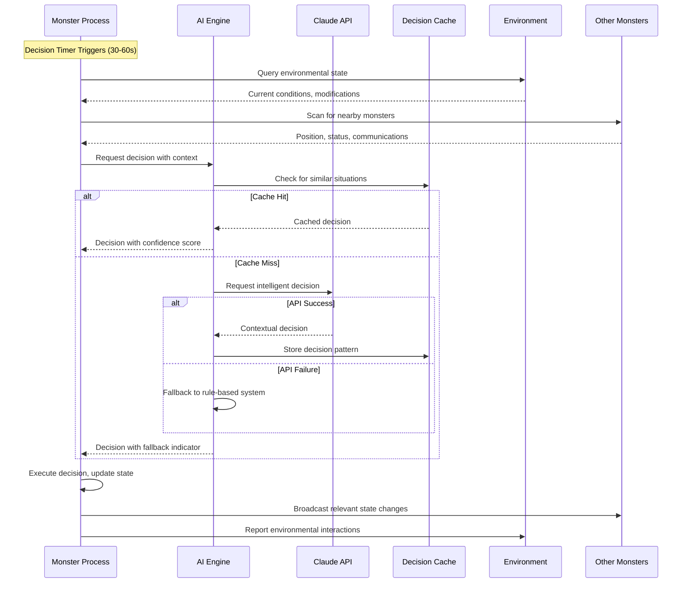
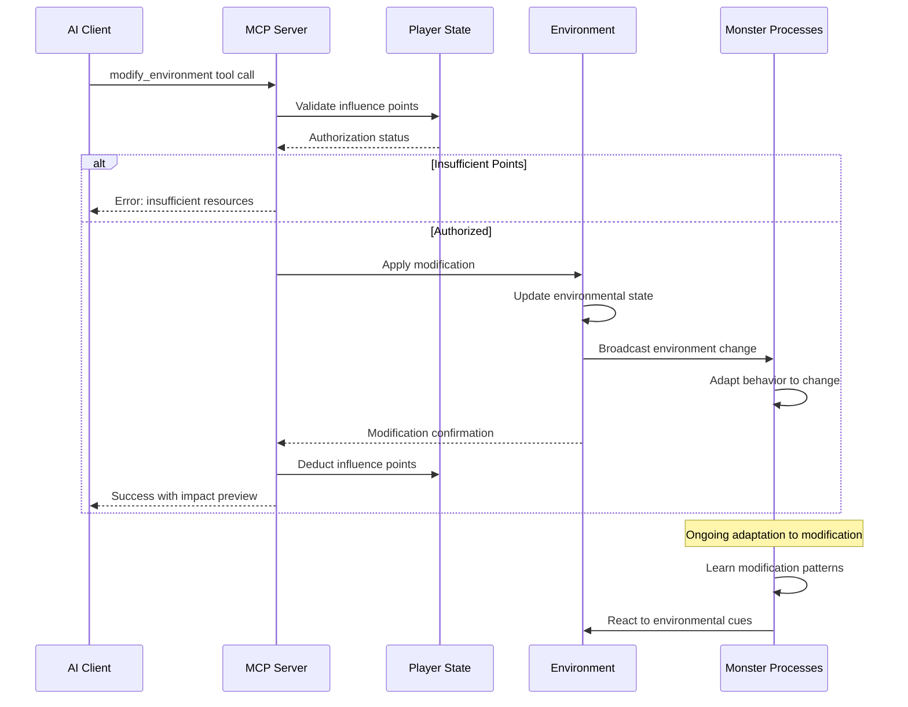
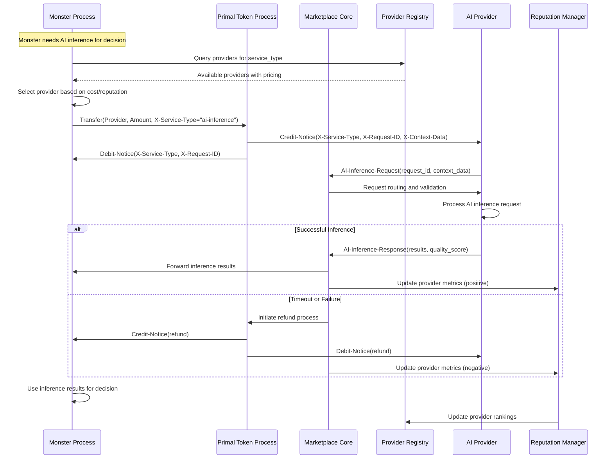

# Core Workflows

## Monster Decision-Making Workflow

```mermaid
sequenceDiagram
    participant MP as Monster Process
    participant AI as AI Engine
    participant CLAUDE as Claude API
    participant CACHE as Decision Cache
    participant ENV as Environment
    participant OTHER as Other Monsters
    
    Note over MP: Decision Timer Triggers (30-60s)
    MP->>ENV: Query environmental state
    ENV-->>MP: Current conditions, modifications
    MP->>OTHER: Scan for nearby monsters
    OTHER-->>MP: Position, status, communications
    MP->>AI: Request decision with context
    AI->>CACHE: Check for similar situations
    alt Cache Hit
        CACHE-->>AI: Cached decision
        AI-->>MP: Decision with confidence score
    else Cache Miss
        AI->>CLAUDE: Request intelligent decision
        alt API Success
            CLAUDE-->>AI: Contextual decision
            AI->>CACHE: Store decision pattern
        else API Failure
            AI->>AI: Fallback to rule-based system
        end
        AI-->>MP: Decision with fallback indicator
    end
    MP->>MP: Execute decision, update state
    MP->>OTHER: Broadcast relevant state changes
    MP->>ENV: Report environmental interactions
```

## Environmental Modification Workflow

```mermaid
sequenceDiagram
    participant CLIENT as AI Client
    participant MCP as MCP Server
    participant PLAYER as Player State
    participant ENV as Environment
    participant MONSTERS as Monster Processes
    
    CLIENT->>MCP: modify_environment tool call
    MCP->>PLAYER: Validate influence points
    PLAYER-->>MCP: Authorization status
    alt Insufficient Points
        MCP-->>CLIENT: Error: insufficient resources
    else Authorized
        MCP->>ENV: Apply modification
        ENV->>ENV: Update environmental state
        ENV->>MONSTERS: Broadcast environment change
        MONSTERS->>MONSTERS: Adapt behavior to change
        ENV-->>MCP: Modification confirmation
        MCP->>PLAYER: Deduct influence points
        MCP-->>CLIENT: Success with impact preview
    end
    
    Note over MONSTERS: Ongoing adaptation to modification
    MONSTERS->>MONSTERS: Learn modification patterns
    MONSTERS->>ENV: React to environmental cues
```

## AI Inference Marketplace Workflow

```mermaid
sequenceDiagram
    participant MONSTER as Monster Process
    participant TOKEN as Primal Token Process
    participant MARKETPLACE as Marketplace Core
    participant REGISTRY as Provider Registry
    participant PROVIDER as AI Provider
    participant REPUTATION as Reputation Manager
    
    Note over MONSTER: Monster needs AI inference for decision
    MONSTER->>REGISTRY: Query providers for service_type
    REGISTRY-->>MONSTER: Available providers with pricing
    MONSTER->>MONSTER: Select provider based on cost/reputation
    
    MONSTER->>TOKEN: Transfer(Provider, Amount, X-Service-Type="ai-inference")
    TOKEN->>PROVIDER: Credit-Notice(X-Service-Type, X-Request-ID, X-Context-Data)
    TOKEN->>MONSTER: Debit-Notice(X-Service-Type, X-Request-ID)
    
    PROVIDER->>MARKETPLACE: AI-Inference-Request(request_id, context_data)
    MARKETPLACE->>PROVIDER: Request routing and validation
    PROVIDER->>PROVIDER: Process AI inference request
    
    alt Successful Inference
        PROVIDER->>MARKETPLACE: AI-Inference-Response(results, quality_score)
        MARKETPLACE->>MONSTER: Forward inference results
        MARKETPLACE->>REPUTATION: Update provider metrics (positive)
    else Timeout or Failure
        MARKETPLACE->>TOKEN: Initiate refund process
        TOKEN->>MONSTER: Credit-Notice(refund)
        TOKEN->>PROVIDER: Debit-Notice(refund)
        MARKETPLACE->>REPUTATION: Update provider metrics (negative)
    end
    
    MONSTER->>MONSTER: Use inference results for decision
    REPUTATION->>REGISTRY: Update provider rankings
```
