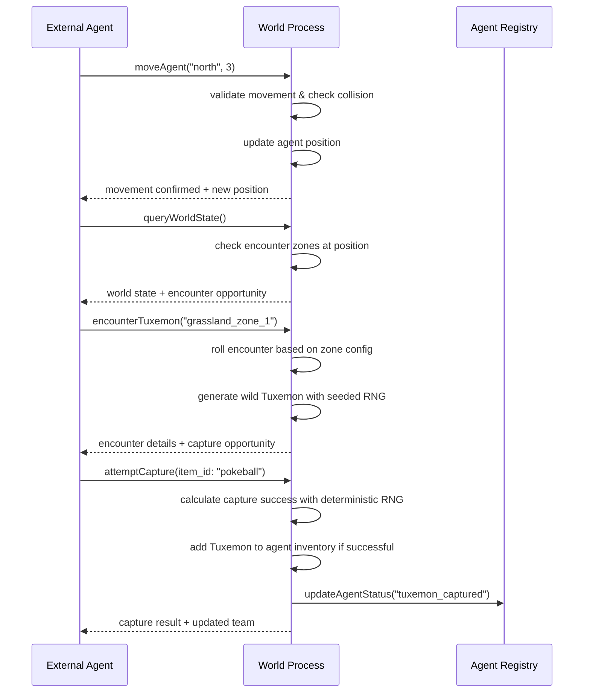
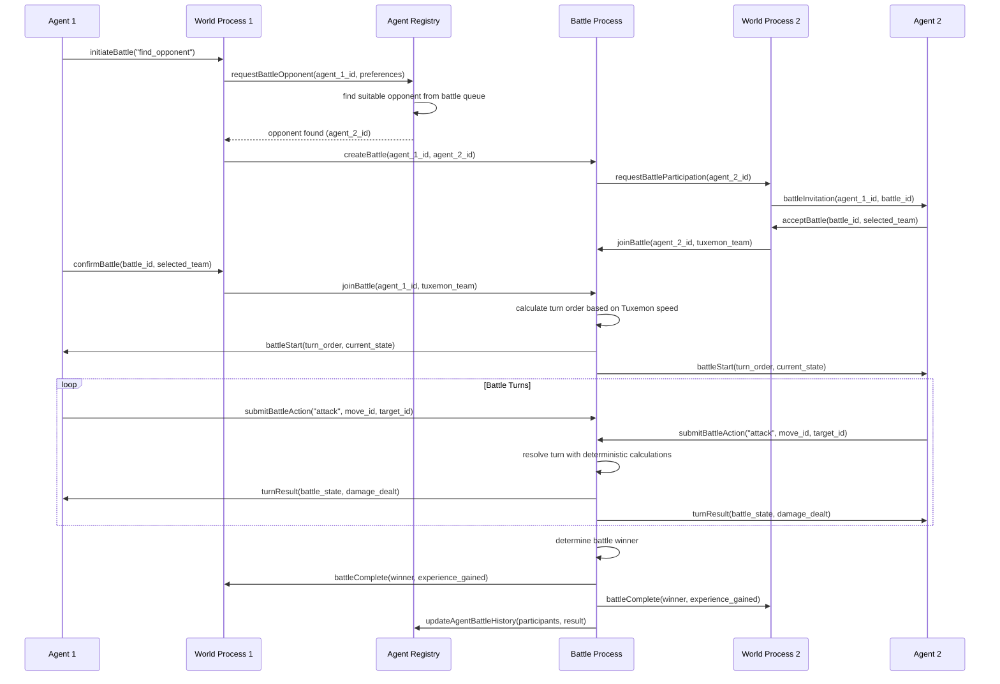

# Core Workflows

The following sequence diagrams illustrate key system workflows that clarify component interactions and complex processes:

## Agent World Exploration and Tuxemon Encounter

## Cross-World Battle Initiation and Resolution

