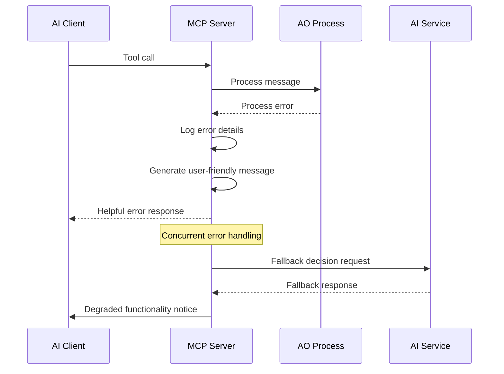

# Error Handling Strategy

## Error Flow


## Error Response Format
```typescript
interface MCPError {
  error: {
    code: string;
    message: string;
    details?: Record<string, any>;
    timestamp: string;
    toolName: string;
    userMessage: string;
  };
}
```

## MCP Tool Error Handling
```typescript
export class MCPToolErrorHandler {
  async handleToolError(error: Error, toolName: string, context: any): Promise<MCPToolResponse> {
    // Log detailed error for debugging
    this.logger.error(`Tool ${toolName} failed:`, {
      error: error.message,
      stack: error.stack,
      context,
      timestamp: new Date().toISOString()
    });
    
    // Generate user-friendly error message
    const userMessage = this.generateUserFriendlyMessage(error, toolName);
    
    return {
      content: [{
        type: "text",
        text: userMessage
      }],
      isError: true
    };
  }
  
  private generateUserFriendlyMessage(error: Error, toolName: string): string {
    const errorMappings = {
      'AOProcessTimeout': 'The ecosystem is currently processing other changes. Please try again in a moment.',
      'InsufficientInfluencePoints': 'You need more influence points to make this environmental change. Try observing the ecosystem to earn more points.',
      'MonsterNotFound': 'That creature seems to have moved to a different area. Use observe_ecosystem to get the current status.',
      'WeatherSystemBusy': 'The weather system is currently active. Please wait for the current weather event to complete.'
    };
    
    return errorMappings[error.name] || `An unexpected issue occurred with ${toolName}. The ecosystem management system is working to resolve this.`;
  }
}
```

## AO Process Error Handling
```lua
-- AO Process Error Handler
local function handle_process_error(error_type, error_data, context)
  -- Log error details
  local error_log = {
    error_type = error_type,
    error_data = error_data,
    context = context,
    timestamp = os.time(),
    process_id = ao.id
  }
  
  -- Store error in process state for debugging
  ErrorLog = ErrorLog or {}
  table.insert(ErrorLog, error_log)
  
  -- Send error response
  ao.send({
    Target = context.sender,
    Action = "Error-Response",
    Data = {
      error = error_type,
      message = get_user_friendly_message(error_type),
      timestamp = os.time()
    }
  })
  
  -- Attempt graceful recovery
  if error_type == "ai_decision_timeout" then
    -- Fall back to rule-based decision
    local fallback_decision = make_rule_based_decision(context)
    execute_monster_action(fallback_decision)
  end
end
```
