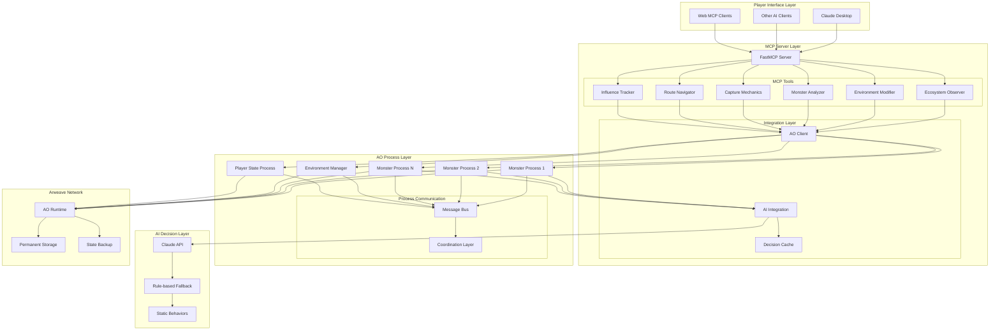

# High Level Architecture

## Technical Summary

PrimalCode implements a **conversational MCP server architecture** where players interact with autonomous AI creatures through natural language commands via Claude Desktop. The system leverages **AO processes** for persistent, autonomous monster behavior, with each creature running as an independent process on the Arweave network. The **FastMCP boilerplate** provides the bridge between AI clients and the creature ecosystem, enabling rich text-based ecosystem management without traditional UI complexity. This architecture creates a truly unique gaming experience that combines decentralized autonomous agents with natural language interaction patterns.

## Platform and Infrastructure Choice

**Platform:** Hybrid Cloud + Arweave/AO Network

**Key Services:**
- **MCP Server Hosting:** AWS/Vercel with auto-scaling capabilities
- **Autonomous Processes:** AO Runtime on Arweave network
- **AI Integration:** Claude API with intelligent fallback systems
- **Monitoring:** CloudWatch + Custom AO process health monitoring
- **Storage:** AO process state + Arweave permanent backup

**Deployment Host and Regions:** 
- Primary: US-East (Virginia) for low latency to Claude API
- Secondary: EU-West (Ireland) for global accessibility
- AO Network: Global decentralized deployment

## Repository Structure

**Structure:** Monorepo with specialized MCP + AO architecture

**Monorepo Tool:** npm workspaces (lightweight, FastMCP compatible)

**Package Organization:**
- `src/` - MCP server implementation
- `ao-processes/` - Lua-based monster and environment processes
- `packages/shared/` - TypeScript types shared between MCP tools
- `docs/` - Architecture and API documentation
- `scripts/` - Deployment and AO process management utilities

## High Level Architecture Diagram

## Architectural Patterns

- **Conversational Interface Pattern:** Natural language tool interfaces for complex ecosystem management - _Rationale:_ Enables intuitive interaction with complex autonomous systems without traditional UI complexity
- **Autonomous Agent Pattern:** Independent AO processes with persistent state and decision-making - _Rationale:_ Creates truly autonomous creatures that operate independently of player presence
- **Multi-tier Decision Fallback:** Hierarchical AI decision system with graceful degradation - _Rationale:_ Ensures system reliability while maintaining intelligent behavior under various conditions
- **Event-Driven Communication:** AO message passing for inter-process coordination - _Rationale:_ Enables complex creature interactions while maintaining process isolation
- **Decentralized Persistence:** State management through AO processes with Arweave backup - _Rationale:_ Provides permanent, tamper-proof game state without traditional database costs
- **Tool-Based Architecture:** MCP tools as primary interface abstraction - _Rationale:_ Standardizes natural language interactions while maintaining extensibility
