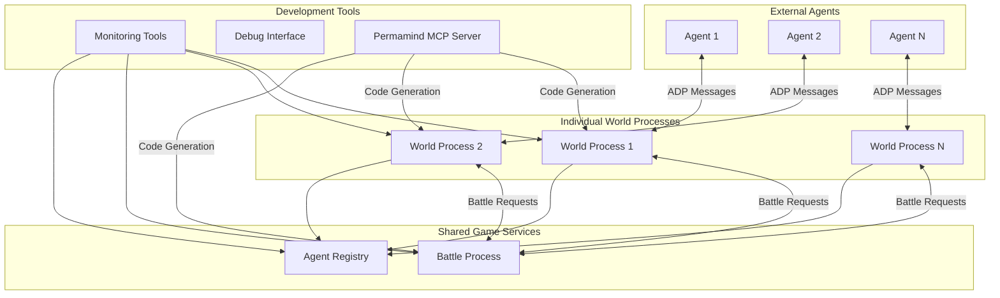

# High Level Architecture

## Technical Summary

The Tuxemon AO Process system employs a **process-based microservices architecture** built entirely on Arweave's AO (Arweave Operating System) infrastructure. Individual AO processes handle discrete game systems (world management, battle resolution, agent registration) that communicate via inter-process messages using ADP-compliant JSON protocols. The architecture prioritizes **agent-native design** where autonomous agents interact through structured message handlers rather than traditional user interfaces, enabling complex strategic gameplay through verifiable, persistent on-chain computations. This design directly supports the PRD's goal of creating the first gaming platform specifically optimized for autonomous agent research and competition.

## High Level Overview

**Architectural Style**: **AO Process-Based Microservices**  
Each game system operates as an independent AO process with dedicated state management and message handling capabilities.

**Repository Structure**: **Monorepo** (per PRD)  
All AO processes, shared utilities, testing infrastructure, and development tooling maintained in a single repository for coordinated development and deployment.

**Service Architecture**: **Individual World Instances + Shared Battle Process** (per PRD)
- Separate AO processes for each agent's world state to eliminate concurrency complexity
- Centralized battle resolution process that agents from different worlds connect to for combat
- Event-driven state synchronization between processes using AO's native message passing

**Primary Interaction Flow**:
1. External agents connect to individual world process instances
2. Agents perform movement, exploration, and Tuxemon collection within their world
3. When combat is initiated, agents connect to shared battle process
4. Battle results propagate back to individual world processes for state updates

**Key Architectural Decisions**:
- **Agent-First Design**: All interfaces optimized for programmatic interaction over human-centric UIs
- **Deterministic Gameplay**: All random number generation uses seeded algorithms for agent predictability
- **Persistent Game History**: Complete action history maintained through AO process state persistence
- **Inter-Process Communication**: Native AO message passing rather than external communication protocols

## High Level Project Diagram

## Architectural and Design Patterns

**AO Process Communication Pattern**: Native message passing between AO processes for battle coordination and state synchronization.  
_Rationale:_ Leverages AO's built-in messaging system for reliable inter-process communication without external dependencies.

**Individual Instance Pattern**: Separate world processes per agent to eliminate concurrency complexity.  
_Rationale:_ Simplifies game logic by avoiding multi-agent collision detection and state conflicts within single processes.

**Shared Service Pattern**: Centralized battle process for fair, verifiable combat between agents from different worlds.  
_Rationale:_ Ensures battle fairness and enables cross-world agent competition while maintaining individual world isolation.

**Repository Pattern**: Abstract data access through AO process state management handlers.  
_Rationale:_ Enables consistent state operations and simplifies testing by encapsulating AO-specific state patterns.

**ADP Message Protocol**: Standardized JSON message structures for all external agent interactions.  
_Rationale:_ Provides predictable, documented interfaces that agents can rely on regardless of implementation language.

**Event-Driven State Synchronization**: Asynchronous state updates between processes using AO message events.  
_Rationale:_ Maintains consistency across distributed game processes while supporting agent autonomy and parallel execution.
